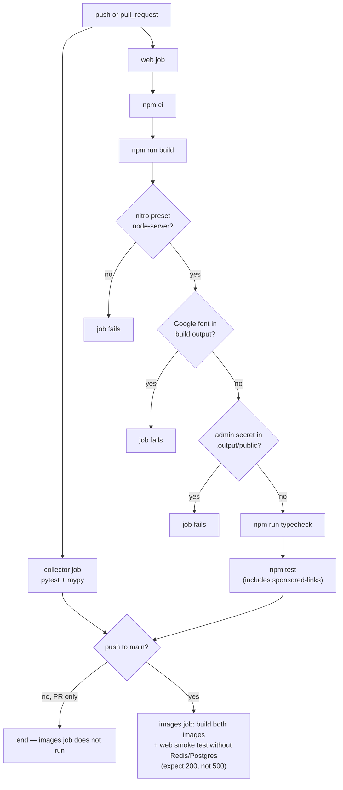

# CLAUDE.md — Agent Instructions for the Tablo Repository

This document is operational rules only: what must never break, how each service's
test/typecheck runs, and this repo's writing conventions. For architecture see
`docs/01-overview.md`, for design `docs/02-design-components.md`, for tech debt
`docs/03-tech-debt.md`, and for the domain `docs/04-domain.md` — I won't repeat
them here.

## This repository is deliberately comment-free

Explanations and docstrings have been deliberately removed from the code.
**Don't add new comments** unless it's a hard warning that the typechecker
and tests won't catch (real examples: the middleware order in
`web/src/start.ts`, the reason `tablo:updated_at:{slug}` has no TTL, or the
pinned Postgres volume name in `compose.prod.yml`). These comments start
with ⚠️ — follow that same pattern, not an ordinary explanatory comment.
Derive behavior from code/tests/migrations, not from memory or other docs.

## Tests and typecheck

| Service | Install | Test | Typecheck | Note |
|---|---|---|---|---|
| collector | `pip install -e ".[dev]"` | `pytest` | `mypy src tests` | `collector/.venv` is stale (an old build path from `mazane.online`, Python 3.14). If it doesn't work, use `PYTHONPATH=src pytest` with the system Python. CI runs on Python 3.12. |
| web | `npm ci` | `npm test` (= `vitest run`) | `npm run typecheck` (= `tsc --noEmit`) | In CI, typecheck runs **after** `npm run build`, because build itself regenerates `src/routeTree.gen.ts`; typechecking the committed version of this file can incorrectly pass/fail. |

Known baseline: collector has 187 green pytest tests + a clean mypy run across 72
files. web has 537 green vitest tests across 31 suites. If the green count drops
below 537, or any suite turns red, that's a real bug.

`web/tests/registry-parity.test.ts` calls a Python script
(`web/tests/support/dump-collector-registry.py`) via `execFileSync("python3", ...)`
— with no guard at all. If `python3` isn't on the machine, this one suite alone
goes red; CI also has no `setup-python`, so if the runner genuinely lacks
`python3`, this is a flaky thread, not a code bug.

## Hard rules that must never break

| Rule | Guardrail |
|---|---|
| Self-hosted fonts — no reference to `fonts.googleapis.com`/`fonts.gstatic.com` | CI step "No external font host…": `grep -rIlE "//fonts\.(googleapis\|gstatic)\.com" .output/public src` |
| No admin-panel secret in the client bundle | CI step "No admin-auth secrets…": `grep` for `scryptSync\|TABLO_ADMIN_PASSWORD_HASH\|TABLO_ADMIN_SESSION_SECRET\|tablo_admin_session` in `.output/public` |
| The nitro preset must be `node-server` (not cloudflare) | Both the CI step and `Dockerfile.web` run `grep -q '"preset": "node-server"' .output/nitro.json` |
| Revenue links only through `/go/<slug>` with `rel="sponsored nofollow noopener"` — never directly to the platform's domain | `web/tests/sponsored-links.test.tsx` (part of `npm test`; CI comment: "this gate must never be softened") |
| Any client-side import from `**/server/**` or `server-only` must break the build | `importProtection` with `behavior: "error"` in `web/vite.config.ts` |
| SQL migrations are always forward-only | The `collector/migrations/` folder has no down files; Postgres runs `*.sql` in lexicographic order only on the first boot of an empty volume — copying a migration file to the server doesn't mean it gets run |

## The draft-template numbers rule

The manual draft enqueue path (`collector/src/tablo_collector/content/gate.py`)
accepts no digit — Persian, Arabic-Indic, or Latin — outside a `{{slot}}`
placeholder; the pattern `_ANY_DIGIT = re.compile(r"\d")` runs against the text
with slots redacted, and any remaining digit raises `DigitOutsideSlotError`.
Every number in a queued draft template must be filled through a slot.

## "Staleness, not error"

A Redis or Postgres outage must never turn a page or API into a 5xx — it must
translate to `null`/`[]`/a "stale" label. CI checks this contract directly too:
the `images` job brings up the web container **without** Redis and Postgres and
expects `GET /` to return 200.

Every data-reading layer in web (`price-source.ts`, `blog.ts`, `history.ts`,
`reference-price.ts`, `views.ts`) implements this contract with a try/catch
around every Redis/Postgres call — the "injectable source" pattern (`setXSource`
/ `setDefaultXSource`) makes this easy to test too. The deliberate exception:
loading a single blog post (`lib/content-data.ts`) and
`listPublishedPostsStrict`, which do not swallow the error — because swallowing
it would mean a fake 404, and Google would deindex the page.

## Other notes

- CI triggers: `push` only on `main`, `pull_request` with no branch filter; the
  `images` job only runs when there's a `push` to `main` (not on a PR).
- CI has no lint step; `npm run lint` (eslint) isn't invoked in any job — if
  you're checking code quality, run it yourself.
- Repository language policy (for agents working in this repo going forward):
  docs, ⚠️ warning comments, test names, and internal dev-only log/exception
  messages are written in English. Product-facing text — UI copy, end-user
  error messages, legal notice text, and anything else a real tablo.gold
  visitor would see — is still written in Persian, because the product itself
  serves Persian-speaking users. Identifiers, paths, and code stay in Latin
  script either way.
