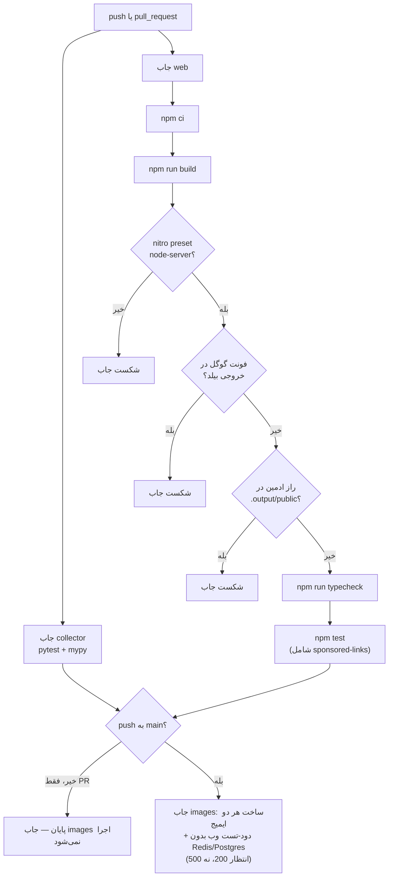

# CLAUDE.md — دستورالعمل ایجنت‌ها برای مخزن تابلو

این سند فقط قواعد اجرایی است: چه چیزی هرگز نباید بشکند، تست/تایپ‌چک هر سرویس چگونه
اجرا می‌شود، و عادت‌های نوشتاری این مخزن. برای معماری به `docs/01-overview.md`، دیزاین
به `docs/02-design-components.md`، بدهی فنی به `docs/03-tech-debt.md`، و دامنه به
`docs/04-domain.md` مراجعه کن — اینجا تکرارشان نمی‌کنم.

## این مخزن عمداً بدون کامنت است

توضیح‌ها و docstringها از عمد از کد حذف شده‌اند. **کامنت تازه اضافه نکن** مگر
هشدار سختی باشد که تایپ‌چکر و تست نمی‌گیرندش (نمونه‌ی واقعی: ترتیب میان‌افزارها در
`web/src/start.ts`، دلیل بی‌TTL بودن `tablo:updated_at:{slug}`، یا پین‌شدن نام
volume پستگرس در `compose.prod.yml`). این کامنت‌ها با ⚠️ شروع می‌شوند — همان الگو
را دنبال کن، نه کامنت توضیحی معمولی. رفتار را از کد/تست/مایگریشن دربیاور، نه از
حافظه یا مستندات دیگر.

## تست و تایپ‌چک

| سرویس | نصب | تست | تایپ‌چک | نکته |
|---|---|---|---|---|
| collector | `pip install -e ".[dev]"` | `pytest` | `mypy src tests` | `collector/.venv` کهنه است (مسیر ساخت قدیمیِ `mazane.online`، پایتون ۳٫۱۴). اگر کار نکرد از `PYTHONPATH=src pytest` با پایتون سیستم استفاده کن. CI روی پایتون ۳٫۱۲ اجرا می‌شود. |
| web | `npm ci` | `npm test` (= `vitest run`) | `npm run typecheck` (= `tsc --noEmit`) | در CI تایپ‌چک **بعد از** `npm run build` می‌آید چون build خودش `src/routeTree.gen.ts` را بازتولید می‌کند؛ تایپ‌چک روی نسخه‌ی کامیت‌شده‌ی این فایل ممکن است اشتباهاً پاس/فیل بدهد. |

باسلاین شناخته‌شده: collector ۱۸۷ تست pytest سبز + mypy تمیز روی ۷۲ فایل. web ۵۳۴
تست vitest سبز در ۳۲ suite، با **یک شکست از قبل موجود**: `tests/tokens-sync.test.ts`
چون `docs/tokens.css` در working tree نیست. این را «رفع» نکن مگر صریحاً خواسته شود؛
اگر عدد سبزها کمتر از ۵۳۴ شد یا suite دیگری هم قرمز شد، آن وقت باگ واقعی است.

`web/tests/registry-parity.test.ts` با `execFileSync("python3", ...)` یک اسکریپت
پایتون (`web/tests/support/dump-collector-registry.py`) را صدا می‌زند — بدون هیچ
guard ای. اگر `python3` روی ماشین نبود همین یک suite قرمز می‌شود؛ CI هم `setup-python`
ندارد، پس اگر runner واقعاً `python3` نداشته باشد این ترد شکننده است، نه باگ کد.

## قواعد سختی که هرگز نباید بشکنند

| قاعده | دروازه‌ی نگهبان |
|---|---|
| فونت خودمیزبان — هیچ ارجاع به `fonts.googleapis.com`/`fonts.gstatic.com` | گام CI «No external font host…»: `grep -rIlE "//fonts\.(googleapis\|gstatic)\.com" .output/public src` |
| هیچ راز پنل ادمین در باندل کلاینت | گام CI «No admin-auth secrets…»: `grep` روی `scryptSync\|TABLO_ADMIN_PASSWORD_HASH\|TABLO_ADMIN_SESSION_SECRET\|tablo_admin_session` در `.output/public` |
| پریست nitro باید `node-server` باشد (نه cloudflare) | گام CI + `Dockerfile.web` هر دو `grep -q '"preset": "node-server"' .output/nitro.json` می‌زنند |
| لینک درآمدزا فقط از `/go/<slug>` با `rel="sponsored nofollow noopener"` — هرگز مستقیم به دامنه‌ی سکو | `web/tests/sponsored-links.test.tsx` (بخشی از `npm test`؛ کامنت CI: «این دروازه هرگز نباید نرم شود») |
| هر import کلاینتی از `**/server/**` یا `server-only` باید بیلد را بشکند | `importProtection` با `behavior: "error"` در `web/vite.config.ts` |
| مهاجرت SQL همیشه رو-به-جلو | پوشه‌ی `collector/migrations/` هیچ فایل down ندارد؛ Postgres فقط در اولین بوت یک volume خالی، `*.sql` را به ترتیب واژه‌نگاری اجرا می‌کند — کپی‌کردن فایل مهاجرت روی سرور به‌معنای اجرا شدنش نیست |

## قاعده‌ی «عدد ساختگی ممنوع»

مسیر تولید محتوای LLM (`collector/src/tablo_collector/content/gate.py`) هیچ رقمی —
فارسی، عربی-هندی یا لاتین — بیرون از جای‌خالی `{{slot}}` نمی‌پذیرد؛ الگو
`_ANY_DIGIT = re.compile(r"\d")` روی متنِ سانسورشده از slotها اجرا می‌شود و رقم
باقی‌مانده `DigitOutsideSlotError` می‌دهد. اگر روی مولد محتوا کار می‌کنی، هر عدد
باید از داده‌ی واقعی از طریق یک slot پر شود، هرگز از متن آزاد مدل.

## «کهنگی، نه خطا»

قطع Redis یا Postgres هرگز نباید صفحه یا API را ۵xx کند — باید به `null`/`[]`/برچسب
«کهنه» ترجمه شود. این قرارداد را CI هم مستقیم می‌سنجد: جاب `images` کانتینر وب را
**بدون** Redis و Postgres بالا می‌آورد و انتظار `GET /` برابر ۲۰۰ دارد.

هر لایه‌ی خواندن داده در web (`price-source.ts`، `blog.ts`، `history.ts`،
`reference-price.ts`، `views.ts`) این قرارداد را با try/catch دور هر فراخوان
Redis/Postgres پیاده می‌کند — الگوی «منبع تزریق‌شدنی» (`setXSource` /
`setDefaultXSource`) هم همین را برای تست ساده می‌کند. استثنای عمدی: بارگذاری
تک‌پست بلاگ (`lib/content-data.ts`) و `listPublishedPostsStrict` که خطا را قورت
نمی‌دهند — چون قورت‌دادن یعنی ۴۰۴ جعلی که گوگل صفحه را ایندکس‌زدایی می‌کند.

## نکات دیگر

- تریگر CI: `push` فقط روی `main`، `pull_request` بدون فیلتر شاخه؛ جاب `images`
  فقط وقتی `push` به `main` باشد اجرا می‌شود (نه روی PR).
- CI هیچ گام lint‌ ندارد؛ `npm run lint` (eslint) در هیچ جابی صدا زده نمی‌شود —
  اگر کیفیت کد را می‌سنجی، خودت اجرایش کن.
- زبان مخزن فارسی است؛ شناسه‌ها، مسیرها و کد به لاتین می‌مانند. متن پیام خطا،
  کامنت هشدار و رشته‌های فارسی رو-به-کاربر را هم فارسی بنویس.
