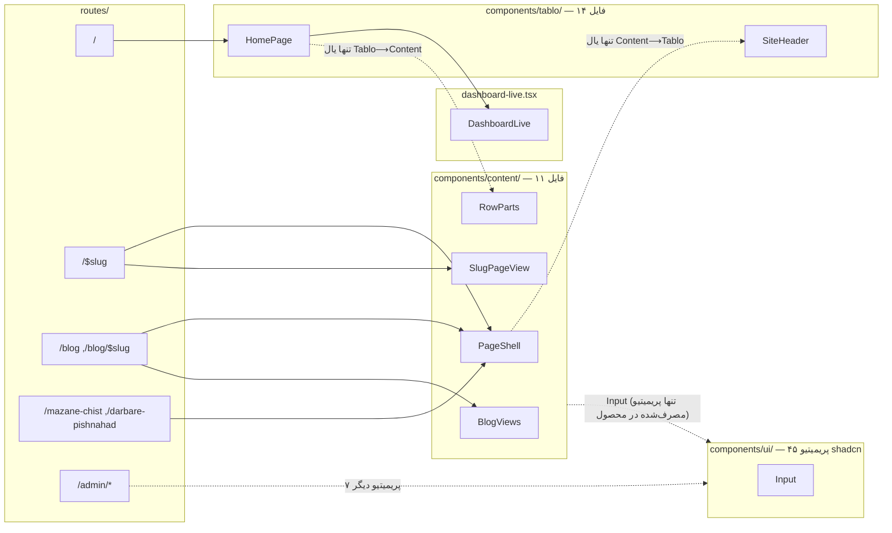

# کامپوننت‌های دیزاین و لایه‌ی نمایش

این سند سه شاخه‌ی `web/src/components/`، سیستم توکن `styles.css`، لایه‌ی `lib/` زیرِ آن‌ها،
و قواعد قالب‌بندی فارسی را می‌پوشاند. هر ادعا مستقیم از خواندن کد تأیید شده؛ جایی که چیزی
قابل تأیید نبود، «نامشخص» نوشته شده.

## ۱. سه درخت کامپوننت و مرزشان

`web/src/components/` سه زیرپوشه و یک فایل مستقل دارد:

| شاخه | تعداد فایل | نقش |
|---|---|---|
| `components/tablo/` | ۱۴ | ترکیب‌کننده‌های صفحه‌ی اصلی (`/`) — همه پشت `HomePage.tsx` |
| `components/content/` | ۱۱ | کیت مشترک «صفحه‌ی جزئیات»: صفحه‌ی دارایی، صفحه‌ی سکو، بلاگ، ۴۰۴، پوسته‌ی صفحه |
| `components/ui/` | ۴۵ | پریمیتیوهای shadcn/ui — کد بالادستی، دست‌نخورده |
| `components/dashboard-live.tsx` | ۱ (مستقل) | لایه‌ی زنده؛ مستقیم روی DOM می‌نویسد، بیرون از هر دو شاخه |

مرز بین `tablo/` و `content/` تقریباً بی‌نشتی است — فقط **دو یال** کل مرز را عبور می‌کنند و هر
دو با خواندن مستقیم import تأیید شدند:

- `components/content/PageShell.tsx` → `components/tablo/SiteHeader.tsx` (پوسته‌ی صفحات محتوا
  همان سربرگ صفحه‌ی اصلی را می‌گیرد)
- `components/tablo/SourceCards.tsx` → `components/content/RowParts.tsx` (کارت‌های منبع صفحه‌ی
  اصلی جزء `Staleness` را از کیت محتوا قرض می‌گیرند)

هیچ فایل کامپوننتی در `tablo/` یا `content/` یتیم نیست — همه از یکی از مسیرهای `routes/`
(مستقیم یا با یک/دو واسطه) قابل دسترسی‌اند. برعکس، در `components/ui/` اکثریت فایل‌ها
هیچ مصرف‌کننده‌ای در کل `src` ندارند (بند ۴ و ۸).

## ۲. `components/tablo/` — کامپوننت‌های صفحه‌ی اصلی

`HomePage.tsx` تنها ترکیب‌کننده است: ۱۲ جزء دیگر از همین شاخه را مستقیم وارد می‌کند — همه‌ی
فایل‌های شاخه به‌جز خودش، **به‌جز `ThemeToggle.tsx`** که مستقیم import نمی‌شود و فقط با واسطه‌ی
`SiteHeader.tsx` به درخت می‌رسد — به‌علاوه‌ی `DashboardLive` از بیرون شاخه.

| فایل | صادرات | نقش | قرارداد داده (props) |
|---|---|---|---|
| `HomePage.tsx` | `HomePage`, `homeHead`, `HomePageData` | تنها ترکیب‌کننده‌ی صفحه‌ی `/`؛ `nowMs` را از `Date.parse(data.generated_at)` می‌سازد، نه `Date.now` | `{data: HomePageData}` با فیلدهای `rows، history، referenceHistory، posts، viewCounts، chartPlatforms، generated_at` |
| `PriceRail.tsx` | `PriceRail` | محور افقی قیمت با فتیله‌ی سوزان ۳۰ثانیه‌ای؛ موقعیت نشانگرها در همان attribute سرور‌رندر است (بدون‌جاوااسکریپت هم خوانا) | `{rail: RailView, updatedAt, updatedAtDisplay, tick: number, failed: boolean, onRefresh: () => void}` |
| `MarketSummary.tsx` | `MarketSummary` | کارت «خلاصه بازار»؛ سه‌زبانه‌ی بازه با `role="tablist"` و ناوبری کیبورد کامل | `{summary: SummaryView}` |
| `SourceCards.tsx` | `SourceCards` | شبکه‌ی کارت هر سکو با اسپارک‌لاین ۲۴ساعته؛ هر کارت به `/go/<slug>` می‌رود | `{sources: RailSource[], nowMs: number}` |
| `AllPlatforms.tsx` | `AllPlatforms` | فهرست متنی همه‌ی سکوها در پاورقی | `{rows: Row[]}` |
| `FeaturedPost.tsx` | `FeaturedPost` | کارت مقاله‌ی ویژه (اولین پست فهرست) | `{post: PublishedPost}` |
| `JewelryCalculator.tsx` | `JewelryCalculator` | ماشین‌حساب طلای زینتی (وزن + اجرت٪ + سود٪ + مالیات٪) | `{pricePerGram: number \| null, referenceName: string \| null}` |
| `LegalNotice.tsx` | `Madde5Bar`, `MADDE5_WARNING_FA` | نوار هشدار قانونی ماده ۵ (نسخه‌ی صفحه‌ی اصلی — `div` با استایل درون‌خطی) | بدون prop |
| `PopularPosts.tsx` | `PopularPosts` | شبکه‌ی «بیشتر بخوانید» یا «پرخواننده‌ترین» بسته به `rankedByViews` | `{posts: PublishedPost[], rankedByViews?: boolean}` |
| `Sidebar.tsx` | `Sidebar` | فهرست «تازه‌ترین نوشته‌ها» در ستون کناری | `{posts: PublishedPost[]}` |
| `SidebarCards.tsx` | `BubbleGauge`, `PriceAlertCard` | دو کارت غیرفعال با نوار مشترک «به زودی فعال می‌شود»؛ آخرین خط `JewelryCalculator` را دوباره صادر می‌کند اما هیچ‌کس از این مسیر نمی‌گیردش | بدون prop |
| `SiteHeader.tsx` | `SiteHeader` | سربرگ چسبان (`sticky`) با ۴ آیتم ناوبری ثابت و `ThemeToggle` | بدون prop |
| `ThemeToggle.tsx` | `ThemeToggle` | دکمه‌ی تعویض تم؛ به `prefers-color-scheme` فقط وقتی گوش می‌دهد که ترجیح ذخیره‌شده‌ای نباشد | بدون prop |
| `home-view.tsx` | `postExcerpt`, `sidebarPosts`, `bottomPosts` | تنها فایل غیرکامپوننتی شاخه: سه تابع خالص کمکی (`maxChars` پیش‌فرض ۱۳۰) | — |

## ۳. `components/content/` — کیت مشترک صفحات محتوا

هیچ ترکیب‌کننده‌ی واحدی ندارد؛ نقطه‌های ورود همان کامپوننت‌هایی‌اند که مستقیم از `routes/`
صدا زده می‌شوند: `PageShell`، `SlugPageView`، `BlogViews`، `NotFoundPanel`.

| فایل | صادرات | نقش | قرارداد داده |
|---|---|---|---|
| `SlugPageView.tsx` | `SlugPageView`, `slugHead`, `slugJsonLdTags`, `SlugPageData` | دروازه‌ی دوحالته‌ی `/$slug`؛ روی فیلد `kind` بین `AssetPage` و `PlatformPage` سوییچ می‌کند | `{data: SlugPageData}` — یونیون `InstrumentPageData \| PlatformPageData` |
| `AssetPage.tsx` | `AssetPage`, `groupRows` | جدول مقایسه‌ی همه‌ی سکوها برای یک دارایی، مرتب‌شده از ارزان‌ترین | `{listing: InstrumentListing, rows: Row[], nowMs: number}` |
| `PlatformPage.tsx` | `PlatformPage` | دوسیه‌ی تک‌سکو: کارمزد، هویت حقوقی، تحویل فیزیکی، نرخ اتحادیه | `{platform, snapshot, updatedAt, hasOutbound, instrumentNames, history, referencePrice, nowMs}` — `instrumentNames` هرگز در بدنه استفاده نمی‌شود (بند ۸) |
| `PlatformRateCard.tsx` | `PlatformRateCard` | کارت نرخ زنده‌ی سکو با نمودار سه‌بازه‌ای، هاور و شمارش‌معکوس ثانیه‌ای مستقل | `{row: Row, history: PlatformHistoryByRange, nowMs: number}` |
| `PlatformCalculator.tsx` | `PlatformCalculator` | ماشین‌حساب دوطرفه‌ی وزن↔مبلغ برای یک سکو؛ تنها فایل صفحات عمومی که از `components/ui` استفاده می‌کند (`Input`) | `{row: Row, hasOutbound: boolean}` |
| `RowParts.tsx` | `Staleness`, `FeeSourceLabel`, `MarketModelBadge`, `ClosedBadges` | چهار جزء نمایشی اتمی مشترک؛ تنها پل `content→tablo` (وارد شده در `tablo/SourceCards`) | props کوچک هرکدام |
| `BlogViews.tsx` | `BlogIndexView`, `BlogPostView`, `blogIndexHead`, `blogPostHead`, `BLOG_INDEX_TITLE/DESCRIPTION` | هم view و هم head-builder برای فهرست و تک‌پست بلاگ | `{posts}` / `{post}` |
| `PageShell.tsx` | `PageShell`, `Breadcrumbs` | پوسته‌ی مشترک همه‌ی صفحات غیر از صفحه‌ی اصلی (`/$slug`, `/blog*`, `/mazane-chist`, `/darbare-pishnahad`)؛ خودش `SiteHeader` تابلو را وارد می‌کند | `{children, wide?}` — `wide` عرض `main` را بین ۸۲۰px و ۱۴۰۰px عوض می‌کند؛ فقط `/$slug` آن را `true` می‌دهد |
| `NotFoundPanel.tsx` | `NotFoundPanel` | پنل ۴۰۴ عمومی، `notFoundComponent` مسیر `/$slug` | `{title?, note?}` |
| `LegalNotice.tsx` | `Madde5Bar`, `MADDE5_WARNING_FA` | نوار هشدار قانونی — نسخه‌ی صفحات محتوا (`footer` با `border-gold/40`)، markup متفاوت با نسخه‌ی `tablo/` (بند ۸) | بدون prop |
| `ViewBeacon.tsx` | `ViewBeacon` | بیکن بی‌صدای شمارش بازدید پس از ۳۰۰۰ میلی‌ثانیه ماندگاری؛ در `navigator.webdriver` اصلاً نمی‌فرستد | `{slug: string}` |

**مستقل از هر دو شاخه:** `components/dashboard-live.tsx` — `DashboardLive({data: LiveDashboard | null})`.
هیچ چیزی رندر نمی‌کند (`return null`)؛ پس از هر polling موفق مستقیم `document.querySelector` می‌زند
و گره‌های `data-rail-marker`، `data-source-card`، `data-rail-min/max/spread` و `.rail-anchor` را
که `PriceRail`/`SourceCards` رندر کرده‌اند وصله می‌زند — تا ترنزیشن ۸۰۰ میلی‌ثانیه‌ای CSS با
re-mount نمیرد. تنها مصرف‌کننده‌اش `HomePage.tsx` است.

## ۴. `components/ui/` — پریمیتیوهای shadcn

دقیقاً **۴۵ فایل `.tsx`** — کد بالادستی (وندورشده با ابزار shadcn، نه دست‌نویس محصول). فقط
**۸ ماژول** حداقل یک مصرف‌کننده‌ی بیرون از `components/ui/` دارند:

| پریمیتیو | مصرف‌کننده‌ی بیرونی |
|---|---|
| `input` | `content/PlatformCalculator.tsx` (تنها مصرف در صفحات عمومی)، ۴ مسیر `routes/admin/*` |
| `button` | ۶ مسیر `routes/admin/*` (`index، login، platforms، posts/index، posts/$slug، posts/new`) |
| `card` | ۳ مسیر `routes/admin/*` (`platforms، posts/*، login`) — `index.tsx` استفاده نمی‌کند |
| `badge` | `routes/admin/posts/index.tsx`, `routes/admin/posts/$slug.tsx` |
| `label` | `routes/admin/posts/$slug.tsx`, `routes/admin/posts/new.tsx`, `routes/admin/login.tsx` |
| `checkbox` | `routes/admin/posts/$slug.tsx` |
| `switch` | `routes/admin/platforms.tsx` |
| `textarea` | `routes/admin/posts/$slug.tsx`, `routes/admin/posts/new.tsx` |

**۷ از این ۸** فقط داخل `routes/admin/*` مصرف می‌شوند؛ `input` تنها پریمیتیوی است که پایش به
صفحات عمومی هم می‌رسد. **۳۷ فایل باقی‌مانده** (`accordion، alert، alert-dialog، aspect-ratio،
avatar، breadcrumb، calendar، carousel، collapsible، command، context-menu، dialog، drawer،
dropdown-menu، form، hover-card، input-otp، menubar، navigation-menu، pagination، popover،
progress، radio-group، resizable، scroll-area، select، separator، sheet، sidebar، skeleton،
slider، sonner، table، tabs، toggle، toggle-group، tooltip`) هیچ مصرف‌کننده‌ای در کل `src`
ندارند — نه در محصول، نه در پنل مدیریت.

## ۵. سیستم توکن — `styles.css`

Tailwind v4 با `@import "tailwindcss" source(none)` + `@source "../src"` + `tw-animate-css`.

**روشن/تاریک کاملاً صفت‌محور است**، نه رسانه‌محور: `@custom-variant dark (&:is([data-theme="dark"] *))`
تنها سازوکار تم در کل فایل است — هیچ بلوک `@media (prefers-color-scheme)` در `styles.css` وجود
ندارد. تصمیم اولیه‌ی تم (سیستم یا ذخیره‌شده) با یک `<script>` درون‌خطی در `<head>` (پیش از
`Scripts`، پس از `HeadContent`) گرفته می‌شود که `SERVER_THEME = "light"` سرور را در صورت لزوم
پیش از اولین رنگ‌آمیزی به `dark` عوض می‌کند؛ `<html>` به همین دلیل `suppressHydrationWarning`
دارد. کلید ذخیره‌سازی `localStorage`، `tablo:theme` است.

| لایه | جای تعریف | تعداد ورودی |
|---|---|---|
| پالت خام روشن | `:root` (`color-scheme: light`) | ۶۱ متغیر |
| بازنویسی تاریک | `[data-theme="dark"]` (`color-scheme: dark`) | ۳۳ متغیر |
| ثبت در Tailwind | `@theme inline` | ۵۶ ورودی: ۴۵ `--color-*`، ۶ شعاع، ۱ `--font-sans`، ۴ `--shadow-*` |

از ۶۱ متغیر `:root`، ۲۸ تا در بلوک تاریک بازنویسی **نمی‌شوند** — نه چون فراموش شده‌اند، بلکه چون
مقدارشان با `var()` به یکی از ۳۰ توکن خامی که واقعاً بازنویسی می‌شوند (`--bg، --ac، --gn، --rd، ...`)
اشاره می‌کند و به‌خاطر رفتار استاندارد custom-property در CSS، خودبه‌خود مقدار تازه را می‌گیرند؛
سه تای دیگر (`--radius، --r-el، --r-pill`) ساختاری‌اند و بین دو تم فرق نمی‌کنند.

توکن‌های معنایی سازگار با shadcn (لایه‌ی بیرونی، همه با `var()` به پالت خام وصل‌اند):

`background، foreground، card، card-foreground، popover، popover-foreground، primary،
primary-foreground، secondary، secondary-foreground، muted، muted-foreground، accent،
accent-foreground، destructive، destructive-foreground، border، input، ring` — به‌علاوه‌ی
`surface، surface-2، gold، gold-soft، positive، positive-soft، negative، negative-soft`
که مخصوص تابلواند.

یک دسته‌ی کوتاه‌نام هم مستقیم به پالت خام وصل است: `tx3، actx، acbg، onac، line2، gn، gnbg،
gntx، rd، rdbg، rdtx، am، ambg` و پنج رنگ سری `s1..s5`.

**چهار توکن تعریف‌شده اما بی‌مصرف** (نه در کلاس، نه در `var()`، در هیچ فایل دیگری از `src`):
`--thumb، --feat، --r-el، --r-pill`.

**فونت:** تک `@font-face` — Vazirmatn variable، `/fonts/vazirmatn-variable-33.0.3.woff2`،
`font-weight: 100 900`، `font-display: swap`. زنجیره‌ی `--font-sans`: `"Vazirmatn", ui-sans-serif,
system-ui, "Segoe UI", Tahoma, sans-serif`. همان فایل در `__root.tsx` با `rel="preload"` و
`crossOrigin="anonymous"` پیش‌بارگذاری می‌شود؛ خودمیزبان است (بدون سرور فونت گوگل) — CI حتی
یک گِرِپ گیت اختصاصی برای این دارد (`docs/03-tech-debt.md`).

**۸ `@utility` سفارشی:** `num`، `no-scrollbar`، `card-surface`، `transition-smooth`، `rise-in`،
`glass-surface`، `glow-primary`، `lift-hover`. از این هشت، `glow-primary` در هیچ فایلی از `src`
استفاده نشده — تنها ارجاعش تعریف خودش است.

دو زبان بصری کنار هم زندگی می‌کنند: `card-surface` (پس‌زمینه‌ی توپر + سایه، فقط در
`components/tablo/*`) و `glass-surface` (شفافیت `color-mix` + `backdrop-filter: blur(18px)`،
پایه‌اش `components/content/*` و `mazane-chist`/`darbare-pishnahad` است، ولی مرز کامل نیست: دو
فایل `tablo/` هم — `PopularPosts.tsx` و `Sidebar.tsx` — از همین کلاس استفاده می‌کنند).

**سه keyframes سفارشی:** `rail-burn` (۳۰ثانیه‌ای linear infinite — فتیله)، `rail-flash` (۰٫۶ثانیه)،
`rise-in` (۴۲۰ میلی‌ثانیه). برای `prefers-reduced-motion: reduce` دو تدبیر جداست: بلوک پایه که
مدت همه‌ی انیمیشن‌ها را به `0.01ms` می‌برد، و بلوکی که فتیله را کاملاً خاموش می‌کند و به‌جایش با
`[data-rail]::after` متن «هر ۳۰ ثانیه» می‌نشاند.

## ۶. لایه‌ی `lib/` و مرز سرور/کلاینت

`web/src/lib/` مجموعاً **۶۱ فایل TypeScript** در سه سطح:

| زیرشاخه | تعداد فایل | محتوا |
|---|---|---|
| `lib/` (ریشه) | ۳۴ | منطق خالص، تایپ‌ها، قالب‌بندی، و «منبع‌های قابل‌تزریق» — قابل import از کلاینت |
| `lib/server/` | ۲۱ | I/O واقعی: Postgres (`pg`)، Redis (`ioredis`)، S3، کوکی نشست ادمین، توکن بازتولید |
| `lib/seo/` | ۶ | `robots.ts، sitemap.ts، cache-headers.ts، edge-cache.ts، admin-headers.ts، admin-security.ts` |

**مرز سرور/کلاینت با دو مکانیزم مستقل اجرا می‌شود:**

1. **قاعده‌ی دایرکتوری‌محور** در `vite.config.ts` (`tanstackStart({ importProtection })`، با
   `behavior: "error"`): هر import در گراف کلاینت از مسیری که پوشه‌ی `server/` در آن باشد
   (`files: ["**/server/**"]`) بیلد را می‌شکند — بدون توجه به اینکه فایل چه چیزی import می‌کند.
2. **نشانه‌ی درون‌فایلی**: هر ۲۱ فایل `lib/server/` با `import "@tanstack/react-start/server-only";`
   شروع می‌شوند (رشته‌ی دقیق، نه بسته‌ی بدون‌پیشوند `server-only`) — یک محافظ خودمستندساز که
   با قاعده‌ی ۱ همپوشانی دارد.

نتیجه‌ی عملی قاعده‌ی ۱: هر تابع سروری که باید از یک مسیر کلاینتی (مثل `routes/index.tsx`)
`import` شود، خودش نباید در پوشه‌ی `server/` باشد — حتی اگر کل بدنه‌اش سروری است. به همین
دلیل `lib/home-data.ts` و `lib/content-data.ts` عمداً **بیرون** از `lib/server/` نشسته‌اند: فایل
نازکی که فقط `createServerFn(...).handler(...)` را صادر می‌کند و import های سروری‌اش (از
`./server/*`) را داخل همان بدنه‌ی handler می‌برد؛ کامپایلر Start بدنه را به باندل سرور جدا می‌کند
و کلاینت فقط خرد RPC می‌گیرد.

**الگوی «منبع قابل‌تزریق»** در ۵ ماژول `lib/` تکرار می‌شود — `prices.ts، blog.ts، history.ts،
views.ts، images.ts`: هرکدام یک `setXSource(source)` (برای تست) و یک `setDefaultXSource(factory)`
(برای ثبت کارخانه‌ی واقعی) صادر می‌کنند؛ خواندن بدون ثبت هیچ‌کدام خطا می‌دهد. ماژول‌های
`lib/server/*Source*` همان `setDefaultXSource` را با پیاده‌سازی Postgres/Redis واقعی صدا
می‌زنند، و تست‌ها به‌جایش نسخه‌ی درون‌حافظه‌ای تزریق می‌کنند — همین اجازه می‌دهد ۳۲ سوییت
vitest بدون بار کردن `ioredis`/`pg` سبز اجرا شوند.

## ۷. قواعد قالب‌بندی عدد و تاریخ فارسی

هیچ عددی که رندر می‌شود از `Intl.NumberFormat` رد نمی‌شود — `lib/fa-number.ts` پیاده‌سازی
دستی دارد، چون خروجی `Intl` به نسخه‌ی ICU محیط گره می‌خورد و نسخه‌ی سرور با نسخه‌ی مرورگر
یکی نیست؛ ناهمخوانی‌اش را ری‌اکت در hydration بی‌صدا ترمیم می‌کند و در هیچ لاگی دیده نمی‌شود.
**تاریخ‌ها استثنای همین قاعده‌اند** — هنوز روی `Intl.DateTimeFormat("fa-IR")` می‌مانند، چون
تقویم جلالی را نمی‌شود بدون پیاده‌سازی کامل و پرخطر دستی نوشت و ریسکش کمتر است (تاریخ پست
ثابت است، هر ۳۰ ثانیه عوض نمی‌شود).

| قاعده | مقدار | منبع |
|---|---|---|
| ارقام | فارسی، نگاشت دستی کاراکتر‌به‌کاراکتر | `fa-number.ts::toPersianDigits` |
| جداکننده‌ی هزارگان | `٬` (U+066C) | |
| جداکننده‌ی اعشار | `٫` (U+066B) | |
| علامت درصد | `٪` (U+066A) | |
| علامت منفی | `−` (U+2212)، با یک LTR mark (U+200E) پیش از آن | |
| گرد کردن | نیم‌رو-به-بالا **روی رشته‌ی ده‌دهی نمایشی**، نه مقدار باینری — `formatFaNumber(2.005,{min:2,max:2})` = «۲٫۰۱» | `roundAbsolute`/`incrementDigits` |
| صفر منفی | `formatFaNumber(-0)` = «۰»، بدون علامت (عمداً واگرا از `Intl`) | |
| عدد نامعتبر | `NaN`، بی‌نهایت، یا `|x| ≥ 1e21` → رشته‌ی «—» + `console.warn` | |
| ساعت | `formatFaClock`: افست ثابت `+۰۳:۳۰` (۲۱۰ دقیقه)، بدون `Intl` | |
| تاریخ/تاریخ‌وساعت | `formatDateFa`/`formatDateTimeFa` روی `Intl.DateTimeFormat("fa-IR", {timeZone:"Asia/Tehran"})` — تنها استثنا | `format.ts` |
| دقت درصد عمومی | `formatPercentFa`/`formatSignedPercentFa`: حداکثر ۲ رقم اعشار | |
| دقت درصد کارمزد | `formatPercentPointsFa`: حداکثر ۳ رقم اعشار | |
| «کهنه» | `STALE_AFTER_MINUTES = 3` (`isStale`: `minutes >= 3`)، پسوند نمایشی « (کهنه)» | `format.ts`/`live-update.ts` |
| زمان نسبی | کمتر از ۱ دقیقه → «لحظاتی پیش»، وگرنه «{عدد فارسی} دقیقه پیش» | `formatMinutesAgoFa` |
| ورودی ماشین‌حساب | هم ارقام فارسی هم عربی‌هندی می‌پذیرد؛ `٬`/`,`/فاصله حذف، `٫`→`.`، مقدار `≤ ۰` رد می‌شود | `calculator.ts::parseCalculatorInput` |
| واژه‌ی «تومان» | `formatToman` فقط عدد می‌دهد؛ واژه در JSX یا در `site-content.ts::toman()` جدا می‌آید | |

## ۸. کامپوننت‌های تکراری یا یتیم

| مورد | جزئیات |
|---|---|
| **`LegalNotice.tsx` دوبار** | هم در `tablo/` هم در `content/`؛ هر دو همان ثابت `MADDE5_WARNING_FA` و همان تابع `Madde5Bar` را صادر می‌کنند و همان `data-legal-notice="madde-5"` + `role="note"` را می‌گذارند (هر دو تست‌شده)، ولی markup فرق دارد: نسخه‌ی `tablo` یک `div` با استایل درون‌خطی روی `--negative`/`--negative-soft`، نسخه‌ی `content` یک `footer` با `border-gold/40 bg-gold-soft/40`. |
| **نام `Sidebar` تکراری** | `tablo/Sidebar.tsx` (فهرست پست‌های کناری) و `ui/sidebar.tsx` (پریمیتیو shadcn، ۲۳٫۴ کیلوبایت، بزرگ‌ترین فایل `ui/`) هر دو `Sidebar` صادر می‌کنند؛ فقط مسیر import آن‌ها را جدا می‌کند. |
| **صادرات مرده** | `tablo/SidebarCards.tsx` در آخرین خط `JewelryCalculator` را دوباره صادر می‌کند، ولی هیچ فایلی از این مسیر آن را نمی‌گیرد — `HomePage.tsx` مستقیم از `./JewelryCalculator` import می‌کند. |
| **prop مرده** | `content/PlatformPage.tsx` پراپ `instrumentNames: Record<string,string>` را می‌گیرد و destructure می‌کند، ولی در کل بدنه‌ی JSX استفاده‌اش نمی‌کند. |
| **جفت کاملاً یتیم** | `components/ui/sidebar.tsx` و `hooks/use-mobile.tsx` — تنها ارجاع به `use-mobile` در کل `src` همان `sidebar.tsx` است، و هیچ فایلی (نه در `ui/`، نه بیرونش) `ui/sidebar.tsx` را import نمی‌کند. هر دو از هیچ مسیری در `routes/` قابل دسترسی نیستند. |
| **۳۶ پریمیتیو دیگر `ui/`** | مثل `accordion، carousel، command، dialog، menubar، table، tabs` — هیچ‌کدام مصرف‌کننده‌ای در `src` ندارند (فهرست کامل در بند ۴)؛ از هیچ مسیری قابل دسترسی نیستند، اما برخلاف جفت بالا حداقل بعضی‌شان داخل خودِ `ui/` به هم وصل‌اند (مثلاً `command.tsx` از `dialog.tsx` import می‌کند) — زنجیره‌ای بسته که به هیچ‌جای بیرون `ui/` نمی‌رسد. |
| **توکن‌های CSS بی‌مصرف** | `--thumb، --feat، --r-el، --r-pill` در `styles.css` تعریف شده‌اند ولی در هیچ کلاس یا `var()` دیگری در `src` استفاده نمی‌شوند (بند ۵). |
| **`@utility` بی‌مصرف** | `glow-primary` — تنها ارجاعش تعریف خودش در `styles.css` است. |
