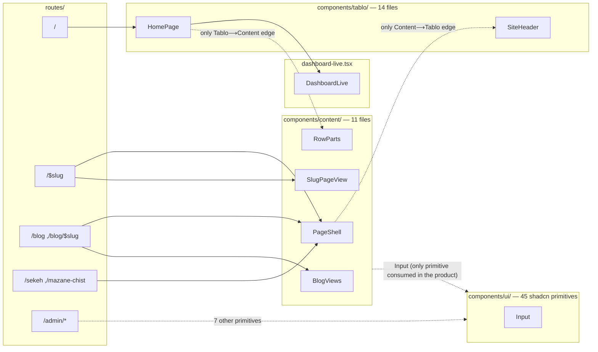

# Design Components and the Display Layer

This document covers the three subtrees of `web/src/components/`, the `styles.css` token
system, the `lib/` layer beneath them, and the Persian formatting rules. Every claim is
verified directly by reading the code; where something couldn't be verified, it's marked
"unknown".

## 1. Three Component Trees and Their Boundary

`web/src/components/` has three subfolders and one standalone file:

| Subtree | File count | Role |
|---|---|---|
| `components/tablo/` | 14 | Compositors for the main page (`/`) — all behind `HomePage.tsx` |
| `components/content/` | 11 | Shared "detail page" kit: asset page, platform page, blog, 404, page shell |
| `components/ui/` | 45 | shadcn/ui primitives — upstream code, untouched |
| `components/dashboard-live.tsx` | 1 (standalone) | Live layer; writes directly to the DOM, outside both subtrees |

The boundary between `tablo/` and `content/` is nearly leak-proof — only **two edges** cross
the entire boundary, and both were confirmed by directly reading the imports:

- `components/content/PageShell.tsx` → `components/tablo/SiteHeader.tsx` (the content pages'
  shell uses the same header as the main page)
- `components/tablo/SourceCards.tsx` → `components/content/RowParts.tsx` (the main page's
  source cards borrow the `Staleness` piece from the content kit)

No component file in `tablo/` or `content/` is orphaned — all are reachable from one of the
`routes/` paths (directly or via one/two intermediaries). By contrast, in `components/ui/`
the majority of files have no consumer anywhere in `src` (sections 4 and 8).

## 2. `components/tablo/` — Main Page Components

`HomePage.tsx` is the sole compositor: it directly imports 12 other pieces from this same
subtree — every file in the subtree except itself, **with the sole exception of
`ThemeToggle.tsx`**, which isn't imported directly and only reaches the tree via
`SiteHeader.tsx` — plus `DashboardLive` from outside the subtree.

| File | Exports | Role | Data contract (props) |
|---|---|---|---|
| `HomePage.tsx` | `HomePage`, `homeHead`, `HomePageData` | The sole compositor for the `/` page; builds `nowMs` from `Date.parse(data.generated_at)`, not `Date.now` | `{data: HomePageData}` with fields `rows, history, referenceHistory, posts, viewCounts, chartPlatforms, generated_at` |
| `PriceRail.tsx` | `PriceRail` | Horizontal price axis with a 30-second burning wick; marker positions are in the same server-rendered attribute (readable even without JavaScript) | `{rail: RailView, updatedAt, updatedAtDisplay, tick: number, failed: boolean, onRefresh: () => void}` |
| `MarketSummary.tsx` | `MarketSummary` | The «خلاصه بازار» card; a three-tab range selector with `role="tablist"` and full keyboard navigation | `{summary: SummaryView}` |
| `SourceCards.tsx` | `SourceCards` | Grid of per-platform cards with a 24-hour sparkline; each card links to `/go/<slug>` | `{sources: RailSource[], nowMs: number}` |
| `AllPlatforms.tsx` | `AllPlatforms` | Text listing of all platforms in the footer | `{rows: Row[]}` |
| `FeaturedPost.tsx` | `FeaturedPost` | Featured article card (first post in the list) | `{post: PublishedPost}` |
| `JewelryCalculator.tsx` | `JewelryCalculator` | Jewelry gold calculator (weight + making-charge% + profit% + tax%) | `{pricePerGram: number \| null, referenceName: string \| null}` |
| `LegalNotice.tsx` | `Madde5Bar`, `MADDE5_WARNING_FA` | Article 5 legal warning bar (main-page version — a `div` with inline styling) | no props |
| `PopularPosts.tsx` | `PopularPosts` | Grid titled «بیشتر بخوانید» or «پرخواننده‌ترین» depending on `rankedByViews` | `{posts: PublishedPost[], rankedByViews?: boolean}` |
| `Sidebar.tsx` | `Sidebar` | The «تازه‌ترین نوشته‌ها» list in the side column | `{posts: PublishedPost[]}` |
| `SidebarCards.tsx` | `BubbleGauge`, `PriceAlertCard` | Two disabled cards sharing a «به زودی فعال می‌شود» banner; its last line re-exports `JewelryCalculator`, but nothing imports it from this path | no props |
| `SiteHeader.tsx` | `SiteHeader` | Sticky header (`sticky`) with 4 fixed navigation items and `ThemeToggle` | no props |
| `ThemeToggle.tsx` | `ThemeToggle` | Theme-toggle button; only listens to `prefers-color-scheme` when there's no stored preference | no props |
| `home-view.tsx` | `postExcerpt`, `sidebarPosts`, `bottomPosts` | The subtree's only non-component file: three pure helper functions (`maxChars` defaults to 130) | — |

## 3. `components/content/` — Shared Content-Page Kit

It has no single compositor; the entry points are the same components called directly from
`routes/`: `PageShell`, `SlugPageView`, `BlogViews`, `NotFoundPanel`.

| File | Exports | Role | Data contract |
|---|---|---|---|
| `SlugPageView.tsx` | `SlugPageView`, `slugHead`, `slugJsonLdTags`, `SlugPageData` | The two-mode gateway for `/$slug`; switches between `AssetPage` and `PlatformPage` based on the `kind` field | `{data: SlugPageData}` — union of `InstrumentPageData \| PlatformPageData` |
| `AssetPage.tsx` | `AssetPage`, `groupRows` | Comparison table of all platforms for one asset, sorted from cheapest | `{listing: InstrumentListing, rows: Row[], nowMs: number}` |
| `PlatformPage.tsx` | `PlatformPage` | Single-platform dossier: fee, legal entity, physical delivery, union rate | `{platform, snapshot, updatedAt, hasOutbound, instrumentNames, history, referencePrice, nowMs}` — `instrumentNames` is never used in the body (section 8) |
| `PlatformRateCard.tsx` | `PlatformRateCard` | Platform's live-rate card with a three-range chart, hover, and an independent per-second countdown | `{row: Row, history: PlatformHistoryByRange, nowMs: number}` |
| `PlatformCalculator.tsx` | `PlatformCalculator` | Two-way weight↔amount calculator for one platform; the only public-page file that uses `components/ui` (`Input`) | `{row: Row, hasOutbound: boolean}` |
| `RowParts.tsx` | `Staleness`, `FeeSourceLabel`, `MarketModelBadge`, `ClosedBadges` | Four shared atomic display pieces; the only `content→tablo` bridge (imported in `tablo/SourceCards`) | small props for each |
| `BlogViews.tsx` | `BlogIndexView`, `BlogPostView`, `blogIndexHead`, `blogPostHead`, `BLOG_INDEX_TITLE/DESCRIPTION` | Both the view and the head-builder for the blog index and a single post | `{posts}` / `{post}` |
| `PageShell.tsx` | `PageShell`, `Breadcrumbs` | Shared shell for every page except the main page (`/$slug`, `/blog*`, `/sekeh`, `/mazane-chist`); it imports Tablo's own `SiteHeader` | `{children, wide?}` — `wide` toggles `main`'s width between 820px and 1400px; `/$slug` and `/sekeh` pass `true` |
| `NotFoundPanel.tsx` | `NotFoundPanel` | Generic 404 panel, the `notFoundComponent` for the `/$slug` route | `{title?, note?}` |
| `LegalNotice.tsx` | `Madde5Bar`, `MADDE5_WARNING_FA` | Legal warning bar — the content-pages version (a `footer` with `border-gold/40`), markup differs from the `tablo/` version (section 8) | no props |
| `ViewBeacon.tsx` | `ViewBeacon` | Silent view-count beacon fired after 3000ms of dwell time; doesn't send at all when `navigator.webdriver` is set | `{slug: string}` |

**Independent of both subtrees:** `components/dashboard-live.tsx` — `DashboardLive({data: LiveDashboard | null})`.
It renders nothing (`return null`); after every successful poll it calls `document.querySelector`
directly and patches the `data-rail-marker`, `data-source-card`, `data-rail-min/max/spread`, and
`.rail-anchor` nodes that `PriceRail`/`SourceCards` rendered — so the 800ms CSS transition doesn't
die from a re-mount. Its only consumer is `HomePage.tsx`.

## 4. `components/ui/` — shadcn Primitives

Exactly **45 `.tsx` files** — upstream code (vendored via the shadcn CLI, not hand-written
product code). Only **8 modules** have at least one consumer outside `components/ui/`:

| Primitive | External consumer |
|---|---|
| `input` | `content/PlatformCalculator.tsx` (the only use on public pages), 4 `routes/admin/*` paths |
| `button` | 6 `routes/admin/*` paths (`index, login, platforms, posts/index, posts/$slug, posts/new`) |
| `card` | 3 `routes/admin/*` paths (`platforms, posts/*, login`) — `index.tsx` doesn't use it |
| `badge` | `routes/admin/posts/index.tsx`, `routes/admin/posts/$slug.tsx` |
| `label` | `routes/admin/posts/$slug.tsx`, `routes/admin/posts/new.tsx`, `routes/admin/login.tsx` |
| `checkbox` | `routes/admin/posts/$slug.tsx` |
| `switch` | `routes/admin/platforms.tsx` |
| `textarea` | `routes/admin/posts/$slug.tsx`, `routes/admin/posts/new.tsx` |

**7 of these 8** are consumed only inside `routes/admin/*`; `input` is the only primitive whose
reach extends to public pages too. **The remaining 37 files** (`accordion, alert, alert-dialog,
aspect-ratio, avatar, breadcrumb, calendar, carousel, collapsible, command, context-menu, dialog,
drawer, dropdown-menu, form, hover-card, input-otp, menubar, navigation-menu, pagination, popover,
progress, radio-group, resizable, scroll-area, select, separator, sheet, sidebar, skeleton,
slider, sonner, table, tabs, toggle, toggle-group, tooltip`) have no consumer anywhere in `src`
— not in the product, not in the admin panel.

## 5. Token System — `styles.css`

Tailwind v4 with `@import "tailwindcss" source(none)` + `@source "../src"` + `tw-animate-css`.

**Light/dark is entirely attribute-driven**, not media-driven: `@custom-variant dark (&:is([data-theme="dark"] *))`
is the only theming mechanism in the whole file — there's no `@media (prefers-color-scheme)` block
anywhere in `styles.css`. The initial theme decision (system or stored) is made by an inline
`<script>` in `<head>` (before `Scripts`, after `HeadContent`) that flips the server's
`SERVER_THEME = "light"` to `dark` before the first paint if needed; `<html>` carries
`suppressHydrationWarning` for exactly this reason. The `localStorage` storage key is `tablo:theme`.

| Layer | Defined in | Entry count |
|---|---|---|
| Raw light palette | `:root` (`color-scheme: light`) | 61 variables |
| Dark overrides | `[data-theme="dark"]` (`color-scheme: dark`) | 33 variables |
| Registered in Tailwind | `@theme inline` | 56 entries: 45 `--color-*`, 6 radii, 1 `--font-sans`, 4 `--shadow-*` |

Of the 61 `:root` variables, 28 are **not** overridden in the dark block — not because they were
forgotten, but because their value points, via `var()`, to one of the 30 raw tokens that actually
do get overridden (`--bg, --ac, --gn, --rd, ...`), and thanks to CSS's standard custom-property
behavior, they automatically pick up the new value; the other three (`--radius, --r-el, --r-pill`)
are structural and don't differ between the two themes.

shadcn-compatible semantic tokens (the outer layer, all wired to the raw palette via `var()`):

`background, foreground, card, card-foreground, popover, popover-foreground, primary,
primary-foreground, secondary, secondary-foreground, muted, muted-foreground, accent,
accent-foreground, destructive, destructive-foreground, border, input, ring` — plus
`surface, surface-2, gold, gold-soft, positive, positive-soft, negative, negative-soft`,
which are Tablo-specific.

A group of short-named tokens is also wired directly to the raw palette: `tx3, actx, acbg, onac,
line2, gn, gnbg, gntx, rd, rdbg, rdtx, am, ambg`, plus the five `s1..s5` series colors.

**Four tokens defined but unused** (not in a class, not in a `var()`, not in any other file in
`src`): `--thumb, --feat, --r-el, --r-pill`.

**Font:** a single `@font-face` — Vazirmatn variable, `/fonts/vazirmatn-variable-33.0.3.woff2`,
`font-weight: 100 900`, `font-display: swap`. The `--font-sans` chain: `"Vazirmatn", ui-sans-serif,
system-ui, "Segoe UI", Tahoma, sans-serif`. The same file is preloaded in `__root.tsx` with
`rel="preload"` and `crossOrigin="anonymous"`; it's self-hosted (no Google Fonts server) — CI even
has a dedicated grep gate for this (`docs/03-tech-debt.md`).

**8 custom `@utility` classes:** `num`, `no-scrollbar`, `card-surface`, `transition-smooth`,
`rise-in`, `glass-surface`, `glow-primary`, `lift-hover`. Of these eight, `glow-primary` is not
used in any file in `src` — its only reference is its own definition.

Two visual languages coexist side by side: `card-surface` (solid background + shadow, only in
`components/tablo/*`) and `glass-surface` (`color-mix` transparency + `backdrop-filter: blur(18px)`,
based mainly in `components/content/*`, `sekeh`, and `mazane-chist`, though the boundary
isn't complete: two `tablo/` files — `PopularPosts.tsx` and `Sidebar.tsx` — also use this same
class).

**Three custom keyframes:** `rail-burn` (30-second linear infinite — the wick), `rail-flash`
(0.6s), `rise-in` (420ms). For `prefers-reduced-motion: reduce` there are two separate measures:
a base block that brings every animation's duration down to `0.01ms`, and a block that turns the
wick off entirely and instead places the text «هر ۳۰ ثانیه» via `[data-rail]::after`.

## 6. The `lib/` Layer and the Server/Client Boundary

`web/src/lib/` has a total of **61 TypeScript files** across three levels:

| Subfolder | File count | Contents |
|---|---|---|
| `lib/` (root) | 34 | Pure logic, types, formatting, and "injectable sources" — importable from the client |
| `lib/server/` | 21 | Real I/O: Postgres (`pg`), Redis (`ioredis`), S3, admin session cookie, revalidation token |
| `lib/seo/` | 6 | `robots.ts, sitemap.ts, cache-headers.ts, edge-cache.ts, admin-headers.ts, admin-security.ts` |

**The server/client boundary is enforced by two independent mechanisms:**

1. **A directory-based rule** in `vite.config.ts` (`tanstackStart({ importProtection })`, with
   `behavior: "error"`): any import in the client graph from a path that has a `server/` folder
   in it (`files: ["**/server/**"]`) breaks the build — regardless of what the file itself
   imports.
2. **An in-file marker**: all 21 `lib/server/` files start with
   `import "@tanstack/react-start/server-only";` (the exact string, not the unprefixed
   `server-only` package) — a self-documenting guard that overlaps with rule 1.

The practical consequence of rule 1: any server function that needs to be `import`ed from a
client path (like `routes/index.tsx`) must itself not live inside a `server/` folder — even if
its entire body is server-side. This is why `lib/home-data.ts` and `lib/content-data.ts`
deliberately sit **outside** `lib/server/`: each is a thin file that only exports
`createServerFn(...).handler(...)` and carries its server-side imports (from `./server/*`) inside
that same handler body; the Start compiler splits the body off into the server bundle, and the
client only gets the RPC stub.

**The "injectable source" pattern** repeats across 5 `lib/` modules — `prices.ts, blog.ts,
history.ts, views.ts, images.ts`: each exports a `setXSource(source)` (for tests) and a
`setDefaultXSource(factory)` (to register the real factory); reading without either being
registered throws. The `lib/server/*Source*` modules call that same `setDefaultXSource` with the
real Postgres/Redis implementation, and tests inject an in-memory version instead — this is what
lets 32 vitest suites run green without ever loading `ioredis`/`pg`.

## 7. Persian Number and Date Formatting Rules

No number that gets rendered passes through `Intl.NumberFormat` — `lib/fa-number.ts` has a manual
implementation, because `Intl`'s output is tied to the environment's ICU version, and the
server's version doesn't match the browser's; React silently patches the mismatch during
hydration, and it never shows up in any log. **Dates are the exception to this same rule** — they
still go through `Intl.DateTimeFormat("fa-IR")`, because the Jalali calendar can't be hand-written
without a complete, high-risk implementation, and the risk is lower here (a post's date is fixed,
it doesn't change every 30 seconds).

| Rule | Value | Source |
|---|---|---|
| Digits | Persian, manual character-to-character mapping | `fa-number.ts::toPersianDigits` |
| Thousands separator | `٬` (U+066C) | |
| Decimal separator | `٫` (U+066B) | |
| Percent sign | `٪` (U+066A) | |
| Negative sign | `−` (U+2212), with an LTR mark (U+200E) before it | |
| Rounding | Round-half-up **on the displayed decimal string**, not the binary value — `formatFaNumber(2.005,{min:2,max:2})` = «۲٫۰۱» | `roundAbsolute`/`incrementDigits` |
| Negative zero | `formatFaNumber(-0)` = «۰», no sign (deliberately diverges from `Intl`) | |
| Invalid number | `NaN`, infinity, or `|x| ≥ 1e21` → the string «—» + `console.warn` | |
| Clock | `formatFaClock`: fixed offset `+03:30` (210 minutes), no `Intl` | |
| Date/date-time | `formatDateFa`/`formatDateTimeFa` on `Intl.DateTimeFormat("fa-IR", {timeZone:"Asia/Tehran"})` — the only exception | `format.ts` |
| General percent precision | `formatPercentFa`/`formatSignedPercentFa`: at most 2 decimal digits | |
| Fee percent precision | `formatPercentPointsFa`: at most 3 decimal digits | |
| «کهنه» (stale) | `STALE_AFTER_MINUTES = 3` (`isStale`: `minutes >= 3`), display suffix « (کهنه)» | `format.ts`/`live-update.ts` |
| Relative time | Less than 1 minute → «لحظاتی پیش», otherwise «{عدد فارسی} دقیقه پیش» | `formatMinutesAgoFa` |
| Calculator input | Accepts both Persian and Arabic-Indic digits; `٬`/`,`/space stripped, `٫`→`.`, value `≤ 0` is rejected | `calculator.ts::parseCalculatorInput` |
| The word «تومان» | `formatToman` only returns the number; the word is added separately, in JSX or in `site-content.ts::toman()` | |

## 8. Duplicate or Orphaned Components

| Item | Details |
|---|---|
| **`LegalNotice.tsx` twice over** | Once in `tablo/`, once in `content/`; both export the same `MADDE5_WARNING_FA` constant and the same `Madde5Bar` function, and both set the same `data-legal-notice="madde-5"` + `role="note"` (both are tested), but the markup differs: the `tablo` version is a `div` with inline styling on `--negative`/`--negative-soft`, the `content` version is a `footer` with `border-gold/40 bg-gold-soft/40`. |
| **Duplicate `Sidebar` name** | `tablo/Sidebar.tsx` (the sidebar post list) and `ui/sidebar.tsx` (the shadcn primitive, 23.4KB, the largest file in `ui/`) both export `Sidebar`; only their import path tells them apart. |
| **Dead export** | `tablo/SidebarCards.tsx` re-exports `JewelryCalculator` on its last line, but no file picks it up from this path — `HomePage.tsx` imports directly from `./JewelryCalculator`. |
| **Dead prop** | `content/PlatformPage.tsx` accepts and destructures the `instrumentNames: Record<string,string>` prop, but never uses it anywhere in the JSX body. |
| **A fully orphaned pair** | `components/ui/sidebar.tsx` and `hooks/use-mobile.tsx` — the only reference to `use-mobile` in all of `src` is `sidebar.tsx` itself, and no file (neither in `ui/` nor outside it) imports `ui/sidebar.tsx`. Neither is reachable from any `routes/` path. |
| **The other 36 `ui/` primitives** | Like `accordion, carousel, command, dialog, menubar, table, tabs` — none has a consumer in `src` (full list in section 4); none is reachable from any route, but unlike the pair above, at least some of them are wired to each other inside `ui/` itself (e.g. `command.tsx` imports from `dialog.tsx`) — a closed chain that never reaches anywhere outside `ui/`. |
| **Unused CSS tokens** | `--thumb, --feat, --r-el, --r-pill` are defined in `styles.css` but aren't used in any other class or `var()` in `src` (section 5). |
| **Unused `@utility`** | `glow-primary` — its only reference is its own definition in `styles.css`. |
