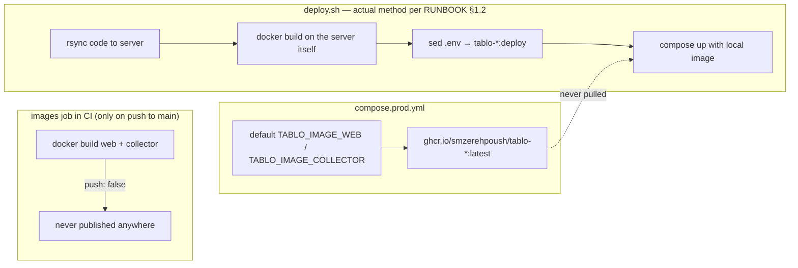

# Technical Debt

This document is an evidence-based list of the `tablo` repo's technical
debt — each item with a precise `file:line` reference, its practical impact
on the product/team, and a specific fix proposal. Severities (High/Medium/Low)
are based on whether the item is breaking something right now, or is a
source of risk/confusion but currently silent.

## Summary

| # | Title | Severity | Area |
|---|---|---|---|
| 1 | Three/four names for one product (`mazane` vs. `tablo`) | Medium | Naming |
| 2 | Platform registry redefined in two languages | Medium | Naming, Data |
| 3 | Two parallel component trees; duplicated `LegalNotice`; orphaned `dashboard-live.tsx` | Medium | Frontend |
| 4 | `PostgresStore.save_instruments`/`save_chart_config` are no-op methods | Medium | Storage |
| 5 | Misaligned triple image/deploy chain | Medium | Deployment |
| 6 | Panel login rate-limit is global and in a single process's memory | Medium | Operational security |
| 7 | All explanatory code comments removed in the working tree (uncommitted) | Medium | Repo hygiene |
| 8 | Three large files in the repo | Low | Maintainability |
| 9 | 37 of 45 `components/ui/` primitives have no consumers | Low | Frontend |
| 10 | The `instrumentNames` prop in `PlatformPage` is unused | Low | Frontend |
| 11 | Registry-parity test depends on `python3` without CI installing it | Low | CI/CD |
| 12 | `collector-dev.log`, about 600 KB, at the repo root | Low | Repo hygiene |
| 13 | `collector/.venv` is outdated and points to the repo's old path | Low | Repo hygiene |

**Fixed (2026-08-15):** The broken `tokens-sync.test.ts` suite was removed after
`docs/tokens.css` was removed from the repository; `web/src/styles.css` is now the
only committed implementation source for these runtime CSS variables.

**Fixed (2026-08-13):** The CI security gate was searching for the old cookie name (`mazane_admin_session`) instead of the real one (`tablo_admin_session`) — the grep pattern in `.github/workflows/ci.yml` and its description in `CLAUDE.md` were both corrected.

---

## 1. CI/CD and Deployment

### 1.1 Misaligned triple image/deploy chain — Severity: Medium

Three docs/files each tell a different story about where the production image comes from:

| | |
|---|---|
| **Evidence** | `.github/workflows/ci.yml:121,133-134` builds both images with `push: false` (comment at line 111: "business owner's decision"). `compose.prod.yml:110,134` takes its defaults from `ghcr.io/smzerehpoush/tablo-{web,collector}:latest`. `deploy.sh:68-69` builds both images with `docker build` on the server, and `deploy.sh:101-102` rewrites the `.env` values to `tablo-web:deploy`/`tablo-collector:deploy` with `sed` — meaning the GHCR defaults in `compose.prod.yml` are never consumed. |
| **Important note for accuracy** | This chain isn't contrary to the actual text of `ops/RUNBOOK.md §1.2` — that section explicitly records the owner's decision (2026-08-08) that "building on the server with `deploy.sh`" is henceforth the standard method, and calls the GHCR path "never set up" (`ops/RUNBOOK.md:136-162`). What hasn't been reconciled is what's **around** that same decision: the CI job and the compose defaults are still configured for the abandoned path, and the runbook's closing checklist still leaves the item "1.2 👤 Registry decision + push wiring" open/unchecked (`ops/RUNBOOK.md:507`) — as if the decision were still pending. |
| **Practical impact** | The `images` job in CI builds two Docker images on every push to main, neither of which is consumed (the collector image isn't even `load`ed); this only burns CI time/minutes. More importantly, any newcomer who only reads the runbook's §12 checklist (not the body of §1.2) might think the registry decision is still open and spend time wiring up GHCR. |
| **Suggested fix** | Either remove/disable the `images` job in CI (since its output is never used), or if it's kept, its comment should explicitly say "only a Dockerfile smoke test, not the publish path." The `ghcr.io` defaults in `compose.prod.yml` should either be removed or get a comment saying "this default is never used in production; `deploy.sh` always overrides it." The runbook's §12 checklist should also be checked off to stay consistent with §1.2. |

### 1.3 Registry-parity test depends on `python3` without CI installing it — Severity: Low

| | |
|---|---|
| **Evidence** | `web/tests/registry-parity.test.ts:1,43-46` runs the `web/tests/support/dump-collector-registry.py` script via `execFileSync("python3", [SCRIPT, COLLECTOR], ...)`. The `web` job in `.github/workflows/ci.yml` only has `actions/setup-node@v4` (lines 42-49); there is no `setup-python` step or Python installation anywhere in the job (checked the full `web` job through the `Tests` step). |
| **Practical impact** | For now, because the runner is `ubuntu-latest` and Python is usually preinstalled, the suite stays green — but this is an implicit, undocumented dependency on the runner image; changing runners, or running these same tests in a bare Node container (which this project has exactly — `Dockerfile.web` is on `node:22-alpine`), would silently break this suite. |
| **Suggested fix** | Add an explicit `actions/setup-python@v5` step to the `web` job, or move the `dump-collector-registry.py` logic to a plain Node/TS script so the test's language boundary doesn't even cross into CI itself. |

---

## 2. Dual Identity and Naming

### 2.1 Three/four names for one product — Severity: Medium

| Name | Where it's seen | Evidence |
|---|---|---|
| `mazane.online` | Git remote | `git remote -v` → `origin git@github.com:smzerehpoush/mazane.online.git` |
| `tablo.gold` | Real product/domain | `web/src/lib/site.ts:1` → `SITE_URL = "https://tablo.gold"` |
| `mazane.collector*` | Prefix of every collector logger | e.g. `collector/src/tablo_collector/main.py:67` → `getLogger("mazane.collector")`; same pattern in `ws.py:13`, `pipeline.py:15`, `robots.py:22`, `references/pipeline.py:13`, `content/*.py` |
| `mazane` | Postgres user/database in production | `compose.prod.yml:39,41` → `POSTGRES_USER:-mazane`, `POSTGRES_DB:-mazane` |

| | |
|---|---|
| **Practical impact** | This scattering isn't merely cosmetic — it has actually caused breakage before. The comment at `deploy.sh:89-93` records a documented incident: during the rename deploy (2026-08-10), because the run directory on the server wasn't in sync with the build directory, compose still wanted the old `MAZANE_*` variables and stopped with "required variable MAZANE_REVALIDATE_TOKEN is missing." The `mazane` name persisting in the logger/database/remote means a similar error (reading the wrong log, a new team member connecting to the wrong database) is still likely — and that same stale name was exactly the source of a similar security bug in the CI grep gate that was fixed on 2026-08-13 (top of this document). |
| **Suggested fix** | Either the naming deliberately stays `mazane` (infrastructure legacy, changing it is high-risk/low-value) and this is explicitly noted in a reference document (e.g. right here) so that any future "security code/cookie name" search sees a checklist of both names; or, in a targeted pass, the loggers and database are also moved to `tablo` and the corresponding migration is added. |

### 2.2 Platform registry redefined in two languages — Severity: Medium

| | |
|---|---|
| **Evidence** | `collector/src/tablo_collector/platforms.py:7` (`PLATFORMS: tuple[Platform, ...] = (...)`) and `web/src/lib/registry.ts:3` (`REGISTRY_PLATFORMS: readonly ListedPlatform[] = [...]`) each independently write the list of platforms (slug, Persian name, `data_policy`, `market_model`, website URL, etc.). The only bridge between the two is `web/tests/registry-parity.test.ts`, which parses the Python with `ast` via `execFileSync("python3", …)` and compares the two lists (the same mechanism as item 1.3). |
| **Practical impact** | The two registries staying in sync depends entirely on someone running this one test before merge and keeping it green; no structural constraint (a shared type, generation from one source) locks the two lists together. Adding a fifteenth platform on only one side — without breaking any typecheck — is entirely possible and would only be discovered by running this specific suite. |
| **Suggested fix** | Make one of the two registries the generation source (e.g. a build-time script that produces a `registry.generated.ts` file from `platforms.py`) so divergence becomes structurally impossible, not just test-guarded. |

---

## 3. Storage Layer

### 3.1 `PostgresStore.save_instruments`/`save_chart_config` are no-op methods — Severity: Medium

| | |
|---|---|
| **Evidence** | `collector/src/tablo_collector/store/postgres_store.py:271-275`: `save_instruments` just has `pass`, and `get_instruments` always returns `()`. Same pattern at `postgres_store.py:298-302` for `save_chart_config`/`get_chart_config`. The `Store` protocol in `collector/src/tablo_collector/store/__init__.py:15-47` declares all 11 methods uniformly, with no indication that two of them are exceptions. |
| **Practical impact** | In `main.py:133-134` the order is `MultiStore(RedisStore(...), PostgresStore(pool))`; since `MultiStore.save_*` fans out to every store, these two writes silently reach Postgres every 20/30 seconds and do nothing — no error, no log. If someone one day wants to read the instrument list or chart settings from Postgres (not Redis), the answer is always empty, with no clue in the code as to why. |
| **Suggested fix** | At minimum, an explicit comment/note above these two methods saying "intentional — this data lives in Redis only", or, if no Postgres history is needed for these two, split the `Store` signature (e.g. a separate "Redis-only" protocol) so a no-op implementation isn't needed at all. |

---

## 4. Frontend and Components

### 4.1 Two parallel component trees; duplicated `LegalNotice`; orphaned `dashboard-live.tsx` — Severity: Medium

| | |
|---|---|
| **Evidence** | `web/src/components/` has three branches: `tablo/` (14 files), `content/` (11 files), and a single standalone file, `dashboard-live.tsx`, outside both (`ls web/src/components`). `LegalNotice.tsx` is written separately in both trees: `web/src/components/tablo/LegalNotice.tsx:1-21` and `web/src/components/content/LegalNotice.tsx:1-17` — both emit exactly the same `MADDE5_WARNING_FA` string and the same `data-legal-notice="madde-5"`/`role="note"`, but the markup differs (the `tablo` version is a `
` with inline styling on `--negative`/`--negative-soft`, the `content` version is a `<footer>` with `border-gold/40 bg-gold-soft/40` classes). |
| **Practical impact** | The legal warning text ("live gold trading...") is already copy-pasted across two files right now; fixing the text or adding a new clause has to be applied in both places at once, otherwise the homepage and content pages (platform/blog) show different legal notices — exactly what has already happened once before (the two files' markup has now drifted apart). Since `dashboard-live.tsx` also sits outside both thematic directories, its logical home isn't clear to someone new to the codebase. |
| **Suggested fix** | A single shared `LegalNotice` (with a prop for visual differences if needed) in one place — e.g. `components/shared/` — imported from both trees. `dashboard-live.tsx` should either move into one of the two trees or explicitly land in its own `components/shared/`/`components/live/` so that "outside the trees" doesn't look accidental. |

### 4.2 37 of 45 `components/ui/` primitives have no consumers outside themselves — Severity: Low

| | |
|---|---|
| **Evidence** | `web/src/components/ui/` has exactly 45 `.tsx` files (`ls components/ui/*.tsx \| wc -l`). Tallying which of these are imported outside `components/ui` (`grep -rl "components/ui/<name>\""` over all of `src` minus `components/ui` itself) turns up only 8: `badge`, `button`, `card`, `checkbox`, `input`, `label`, `switch`, `textarea` — and seven of these eight are consumed only in `routes/admin/*` (`input` is also used in `components/content/PlatformCalculator.tsx:3`). That means the remaining 37 files — including `web/src/components/ui/sidebar.tsx` (744 lines, the largest file in the whole component tree) — have no consumers outside `components/ui`. `hooks/use-mobile.tsx` is only imported from that same `sidebar.tsx:6`, so both are effectively dead. |
| **Practical impact** | A significant volume of shadcn/ui code (including the largest file in the repo at this layer) has no render path in the product; maintaining, updating, and reviewing it takes time with no payoff. Tree-shaking in the final build likely eliminates these, so it's not a bundle risk — the risk is maintainability and misleading anyone browsing the code. |
| **Suggested fix** | Either delete these 37 files (and `use-mobile.tsx`) and re-add them from shadcn if needed later, or, if keeping them is intentional (e.g. for future admin panel development), a short note in this document/the README should record that. |

### 4.3 The `instrumentNames` prop in `PlatformPage` is unused — Severity: Low

| | |
|---|---|
| **Evidence** | `web/src/components/content/PlatformPage.tsx:123,132` destructures the `instrumentNames: Record<string, string>` prop, but there's no reference to it anywhere in the component's JSX body (lines after the definition through the end of the file). |
| **Practical impact** | Just a dead prop; nothing breaks, but every new reader assumes this prop is consumed somewhere and goes looking for its logic. |
| **Suggested fix** | Either remove the prop and its call site, or, if the instrument name was meant to be displayed somewhere on the page, finish that render. |

---

## 5. Operational Security

### 5.1 Panel login rate-limit is global and in a single process's memory — Severity: Medium

| | |
|---|---|
| **Evidence** | `web/src/lib/server/admin-session.ts:19-20` keeps a module-level `Map<string, AttemptState>` (`attemptsByKey`) with one fixed key (`RATE_LIMIT_KEY = "login"`). `web/src/lib/admin-auth.ts:69-70` sets `MAX_LOGIN_ATTEMPTS = 5` and `LOCKOUT_MS = 15 * 60 * 1000`. |
| **Practical impact** | Because the key is global rather than per-IP/per-user, five consecutive failed logins from **any source** — an admin mistyping their password, or a simple bot scan — locks the entire panel for all admins and all IPs for 15 minutes (self-DoS). Because it's an in-memory `Map` in that same Node process, every web restart/deploy (which, per `compose.prod.yml`, is a single instance, so horizontal scaling isn't a concern for now) resets the counter to zero — meaning real protection against a persistent brute-force attacker (one who waits for the service to come back up) is zero. |
| **Suggested fix** | Tie the rate-limit key to IP or username so one user can't lock out everyone, and move the counter to a store that persists across restarts (the same Redis this project already has). |

---

## 6. Repo Hygiene

### 6.1 All explanatory code comments removed in the working tree (uncommitted) — Severity: Medium

| | |
|---|---|
| **Evidence** | `git status --short` currently shows 228 lines (225 modified tracked files + 3 newly untracked paths: `CLAUDE.md`, `README.md`, `docs/`); `git diff HEAD --stat` reports a total of `397 insertions(+), 6796 deletions(-)` for those same 225 tracked files. For example, `git show HEAD:collector/src/tablo_collector/main.py` has 384 lines and includes multi-line explanatory comments (e.g. the "seven parallel tasks" explanation at the top of the file), but the current on-disk version (`collector/src/tablo_collector/main.py`) has 281 lines and zero lines starting with `#` (`grep -c "^\s*#"` → 0). This change hasn't been committed yet — meaning the current committed version (`HEAD`, not necessarily `HEAD~1`) still has the comments and they're recoverable via `git show HEAD:<path>`. The only comments remaining on disk are `⚠️` markers. |
| **Practical impact** | As long as this state isn't committed, nothing is lost — the history of "whys" is still available via `git show HEAD:<path>`. But any reader who only reads the on-disk files (not git) sees no design rationale beyond the raw code logic, and if these changes are ever recorded with `git add -A && git commit` or similar, this volume of in-code documentation is permanently removed from the current HEAD (though it remains in history). |
| **Suggested fix** | Before any commit on this working tree, either selectively restore the "why" comments (not the obvious "what" explanations), or, if the removal is intentional and final, record that decision explicitly in the corresponding commit message so it isn't lost in history. |

### 6.2 Three large files in the repo — Severity: Low

| File | Lines | Note |
|---|---|---|
| `web/src/components/ui/sidebar.tsx` | 744 | As noted in 4.2, this file is both the largest and completely dead |
| `collector/src/tablo_collector/content/generator.py` | 476 | Live and heavily used; contains all five `TOPIC_BUILDER`s (fee comparison, minimum order, etc.), prompt builders, and the Gemini client in one file |
| `collector/src/tablo_collector/store/postgres_store.py` | 450 | Live; implements both `Store` and `RetentionStore` in a single class (`PostgresStore`) |

| | |
|---|---|
| **Practical impact** | Maintainability only; nothing in tests or CI trips over these. `generator.py` and `postgres_store.py` each combine several responsibilities (prompt building + content generation + CLI; or price CRUD + retention + settings) in one file. |
| **Suggested fix** | `sidebar.tsx` should be removed per 4.2. `generator.py` could move `TOPIC_BUILDERS` into a separate module; `postgres_store.py` could move the `RetentionStore` portion into its own file (e.g. `postgres_retention.py`), since its protocols are already defined separately (`Store` vs. `RetentionStore`). |

### 6.3 `collector-dev.log`, about 600 KB, at the repo root — Severity: Low

| | |
|---|---|
| **Evidence** | `ls -la collector-dev.log` → about 605 KB. The `*.log` pattern is in `.gitignore:19`, so the file has never been committed and isn't tracked; it's just sitting on local disk. |
| **Practical impact** | There's no risk of it leaking into the repo (gitignore works correctly); it's simply a forgotten local log file taking up workspace disk space. |
| **Suggested fix** | Delete it manually, locally; not worth adding an automated cleanup workflow since it's already gitignored. |

### 6.4 `collector/.venv` is outdated — Severity: Low

| | |
|---|---|
| **Evidence** | `collector/.venv/pyvenv.cfg` → `command = .../python3.14 -m venv /Users/mahdiyar/w/mazane.online/collector/.venv` — the build path still points to the repo's old name (`mazane.online`) and a different Python version (3.14; the project requires `>=3.12`). The scripts installed in `collector/.venv/bin/` also still carry the old names: `mazane-collector`, `mazane-enqueue`, `mazane-generate`, `mazane-retract` (which in the current `pyproject.toml` are named `tablo-collector`/`tablo-enqueue`/`tablo-generate`/`tablo-retract` respectively). |
| **Practical impact** | Activating this venv and running its Python directly is misleading because the installed package isn't in sync with the current code; that's exactly why both CI (`.github/workflows/ci.yml`, `collector` job) and `CLAUDE.md` declare the primary path as `pip install -e ".[dev]"` followed by `pytest` (not this venv) — `PYTHONPATH=src pytest` is documented only as a fallback path if the install fails. Nothing breaks in CI because CI never sees this directory at all. |
| **Suggested fix** | Delete `collector/.venv` and rebuild it with `python3.12 -m venv .venv && pip install -e ".[dev]"`, or explicitly document that developers should always use `PYTHONPATH=src` and ignore the venv. |
