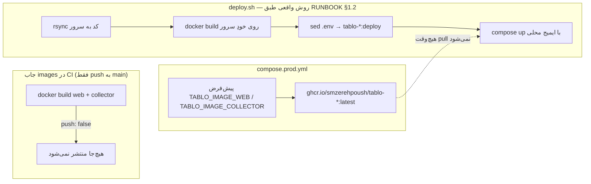

# بدهی فنی

این سند فهرست بدهی فنیِ شاهدمحور مخزن `tablo` است — هر مورد با ارجاع دقیق به
`file:line`، اثر عملی آن روی محصول/تیم، و یک پیشنهاد رفع مشخص. شدت‌ها
(بالا/متوسط/پایین) بر اساس این می‌آیند که مورد همین حالا چیزی را می‌شکند
یا سرمنشأ ریسک/گیج‌کنندگی است اما فعلاً ساکت.

## خلاصه

| # | عنوان | شدت | حوزه |
|---|---|---|---|
| ۱ | CI روی main قرمز است (`tokens-sync.test.ts`) | بالا | CI/CD |
| ۲ | سه/چهار نام برای یک محصول (`mazane` در برابر `tablo`) | متوسط | نام‌گذاری |
| ۳ | رجیستری سکو در دو زبان دوباره تعریف شده | متوسط | نام‌گذاری، داده |
| ۴ | دو درخت کامپوننت موازی؛ `LegalNotice` تکراری؛ `dashboard-live.tsx` یتیم | متوسط | فرانت‌اند |
| ۵ | `PostgresStore.save_instruments`/`save_chart_config` متد no-op اند | متوسط | ذخیره‌سازی |
| ۶ | زنجیره‌ی ایمیج/دیپلوی سه‌گانه‌ی ناهم‌راستا | متوسط | استقرار |
| ۷ | rate-limit ورود پنل، سراسری و در حافظه‌ی یک پردازه | متوسط | امنیت عملیاتی |
| ۸ | کل کامنت‌های توضیحی کد در working tree حذف شده‌اند (کامیت‌نشده) | متوسط | بهداشت مخزن |
| ۹ | سه فایل بزرگ در مخزن | پایین | نگهداری‌پذیری |
| ۱۰ | ۳۷ از ۴۵ پریمیتیو `components/ui/` هیچ مصرف‌کننده‌ای ندارند | پایین | فرانت‌اند |
| ۱۱ | پراپ `instrumentNames` در `PlatformPage` بلااستفاده است | پایین | فرانت‌اند |
| ۱۲ | تست تراز رجیستری به `python3` وابسته است بی‌آنکه CI آن را نصب کند | پایین | CI/CD |
| ۱۳ | `collector-dev.log` حدود ۶۰۰ کیلوبایت در ریشه‌ی مخزن | پایین | بهداشت مخزن |
| ۱۴ | `collector/.venv` کهنه است و به مسیر قدیمی مخزن اشاره می‌کند | پایین | بهداشت مخزن |

**رفع‌شده (۲۰۲۶-۰۸-۱۳):** دروازه‌ی امنیتی CI دنبال نام کوکیِ کهنه (`mazane_admin_session`) می‌گشت نه نام واقعی (`tablo_admin_session`) — الگوی گرپ در `.github/workflows/ci.yml` و توصیفش در `CLAUDE.md` هر دو اصلاح شدند.

---

## ۱. CI/CD و استقرار

### ۱.۱ CI روی main قرمز است — شدت: بالا

| | |
|---|---|
| **شاهد** | `web/tests/tokens-sync.test.ts:14-33` در بدنه‌ی `describe` مستقیماً `read("docs/tokens.css")` را صدا می‌زند (خط ۳۲). دایرکتوری `docs/` در working tree موجود اما خالی است؛ آخرین کامیتی که به آن دست زده `3d507c3 remove docs` است (`git log --oneline -1 -- docs`). |
| **اثر عملی** | خواندن فایل با `ENOENT` شکست می‌خورد و چون این فراخوانی داخل بدنه‌ی `describe` (نه داخل `it`) است، کل فایل تست موقع collect می‌ترکد — یعنی این یک suite شکست‌خورده از ۳۲ suite است، ولی به‌خاطر جای شکست، جاب `web` در CI (`.github/workflows/ci.yml` گام `Tests`) روی هر push به main و هر PR قرمز می‌ماند. |
| **پیشنهاد رفع** | یا `docs/tokens.css` را به‌عنوان منبع حقیقتِ پالت رنگ بازسازی و با `web/src/styles.css` هم‌تراز کرد، یا تصمیم گرفت که `styles.css` تنها منبع حقیقت است و `tokens-sync.test.ts` را حذف/بازنویسی کرد. نگه‌داشتن یک تست شکست‌خورده روی main یعنی هر شکست تست بعدی هم در نویز CI گم می‌شود. |

### ۱.۲ زنجیره‌ی ایمیج/دیپلوی سه‌گانه‌ی ناهم‌راستا — شدت: متوسط

سه سند/فایل، سه داستان متفاوت از این‌که ایمیج تولید از کجا می‌آید تعریف می‌کنند:

| | |
|---|---|
| **شاهد** | `.github/workflows/ci.yml:121,133-134` هر دو ایمیج را با `push: false` می‌سازد (کامنت خط ۱۱۱: «تصمیم صاحب کسب‌وکار است»). `compose.prod.yml:110,134` پیش‌فرض‌ها را از `ghcr.io/smzerehpoush/tablo-{web,collector}:latest` می‌گیرد. `deploy.sh:68-69` هر دو ایمیج را با `docker build` روی سرور می‌سازد و `deploy.sh:101-102` با `sed` مقادیر `.env` را به `tablo-web:deploy`/`tablo-collector:deploy` بازنویسی می‌کند — یعنی پیش‌فرض‌های GHCR در `compose.prod.yml` هرگز مصرف نمی‌شوند. |
| **نکته‌ی مهم برای صحت** | این زنجیره برخلاف متن اصلی `ops/RUNBOOK.md §۱.۲` نیست — آن بخش صریحاً تصمیم مالک (۲۰۲۶-۰۸-۰۸) را ثبت کرده که «ساخت روی سرور با `deploy.sh`» از این پس روش استاندارد است و مسیر GHCR را «هیچ‌وقت راه‌اندازی نشد» می‌نامد (`ops/RUNBOOK.md:136-162`). چیزی که هماهنگ نشده، **پیرامون** همان تصمیم است: جاب CI و پیش‌فرض‌های compose هنوز برای مسیر رهاشده تنظیم مانده‌اند، و چک‌لیست پایانی رانبوک هنوز آیتم «۱.۲ 👤 تصمیم رجیستری + سیم‌کشی push» را باز/تیک‌نخورده نگه داشته (`ops/RUNBOOK.md:507`) — انگار تصمیم هنوز معلق است. |
| **اثر عملی** | جاب `images` در CI روی هر push به main دو ایمیج داکر می‌سازد که هیچ‌کدام مصرف نمی‌شوند (ایمیج collector حتی `load` هم نمی‌شود)؛ این فقط زمان/دقایق CI را می‌سوزاند. مهم‌تر، هر عملیاتیِ تازه که فقط چک‌لیست §۱۲ رانبوک را بخواند (نه بدنه‌ی §۱.۲ را) ممکن است فکر کند تصمیم رجیستری هنوز باز است و وقت روی سیم‌کشی GHCR بگذارد. |
| **پیشنهاد رفع** | یا جاب `images` در CI حذف/غیرفعال شود (چون خروجی‌اش هرگز استفاده نمی‌شود)، یا اگر نگه داشته می‌شود کامنتش صریح بگوید «فقط برای دود-تستِ Dockerfile، نه مسیر انتشار». پیش‌فرض‌های `ghcr.io` در `compose.prod.yml` یا حذف شوند یا کامنتی بگیرند که «این پیش‌فرض هرگز در تولید استفاده نمی‌شود؛ `deploy.sh` همیشه رونویسی می‌کند». چک‌لیست §۱۲ رانبوک هم برای هماهنگی با §۱.۲ تیک بخورد. |

### ۱.۳ تست تراز رجیستری به `python3` وابسته است بی‌آنکه CI آن را نصب کند — شدت: پایین

| | |
|---|---|
| **شاهد** | `web/tests/registry-parity.test.ts:1,43-46` با `execFileSync("python3", [SCRIPT, COLLECTOR], ...)` اسکریپت `web/tests/support/dump-collector-registry.py` را اجرا می‌کند. جاب `web` در `.github/workflows/ci.yml` فقط `actions/setup-node@v4` دارد (خطوط ۴۲-۴۹)؛ در کل جاب هیچ گام `setup-python` یا نصب پایتونی نیست (بررسی کامل مراحل `web` تا گام `Tests`). |
| **اثر عملی** | فعلاً چون runner از نوع `ubuntu-latest` است و پایتون معمولاً پیش‌نصب دارد، suite سبز می‌ماند — اما این وابستگی‌ای ضمنی و مستندنشده به تصویر runner است؛ تغییر runner یا اجرای همین تست‌ها در یک کانتینر Node خالص (که این پروژه دقیقاً دارد — `Dockerfile.web` روی `node:22-alpine` است) بی‌سروصدا این suite را می‌شکند. |
| **پیشنهاد رفع** | یک گام `actions/setup-python@v5` صریح به جاب `web` اضافه شود، یا منطق `dump-collector-registry.py` به یک اسکریپت Node/TS ساده منتقل شود تا مرز زبانی تست از خود CI هم عبور نکند. |

---

## ۲. هویت و نام‌گذاری دوگانه

### ۲.۱ سه/چهار نام برای یک محصول — شدت: متوسط

| نام | جایی که دیده می‌شود | شاهد |
|---|---|---|
| `mazane.online` | ریموت گیت | `git remote -v` → `origin git@github.com:smzerehpoush/mazane.online.git` |
| `tablo.gold` | محصول/دامنه‌ی واقعی | `web/src/lib/site.ts:1` → `SITE_URL = "https://tablo.gold"` |
| `mazane.collector*` | پیشوند همه‌ی لاگرهای گردآورنده | مثلاً `collector/src/tablo_collector/main.py:67` → `getLogger("mazane.collector")`؛ همین الگو در `ws.py:13`، `pipeline.py:15`، `robots.py:22`، `references/pipeline.py:13`، `content/*.py` |
| `mazane` | کاربر/دیتابیس پستگرس در تولید | `compose.prod.yml:39,41` → `POSTGRES_USER:-mazane`، `POSTGRES_DB:-mazane` |

| | |
|---|---|
| **اثر عملی** | این پراکندگی فقط زیبایی‌شناختی نیست — قبلاً واقعاً باعث خرابی شده. کامنت `deploy.sh:89-93` یک حادثه‌ی مستند را ثبت می‌کند: در دیپلویِ تغییر نام (۲۰۲۶-۰۸-۱۰) چون دایرکتوری اجرا روی سرور با دایرکتوری ساخت هم‌گام نبود، compose هنوز متغیرهای `MAZANE_*` قدیمی می‌خواست و با پیام «required variable MAZANE_REVALIDATE_TOKEN is missing» متوقف شد. باقی‌ماندن نام `mazane` در لاگر/دیتابیس/ریموت یعنی خطای مشابه (خواندن لاگ اشتباه، اتصال به دیتابیس اشتباه توسط عضو تازه‌ی تیم) هنوز محتمل است — و همان نام کهنه دقیقاً سرچشمه‌ی یک باگ امنیتی مشابه در دروازه‌ی گرپ CI بود که در ۲۰۲۶-۰۸-۱۳ رفع شد (بالای این سند). |
| **پیشنهاد رفع** | یا نام‌گذاری‌ها عمداً `mazane` بمانند (میراث زیرساخت، تغییرش پرریسک/کم‌ارزش است) و همین در یک سند مرجع (مثلاً همین‌جا) صراحتاً یادداشت شود تا هر جست‌وجوی «کد امنیتی/نام کوکی» چک‌لیستی از هر دو نام را ببیند؛ یا در یک پاس هدفمند لاگرها و دیتابیس هم به `tablo` منتقل شوند و migration مربوطه اضافه شود. |

### ۲.۲ رجیستری سکو در دو زبان دوباره تعریف شده — شدت: متوسط

| | |
|---|---|
| **شاهد** | `collector/src/tablo_collector/platforms.py:7` (`PLATFORMS: tuple[Platform, ...] = (...)`) و `web/src/lib/registry.ts:3` (`REGISTRY_PLATFORMS: readonly ListedPlatform[] = [...]`) هر دو، مستقل از هم، فهرست سکوها (اسلاگ، نام فارسی، `data_policy`، `market_model`، نشانی وب‌سایت و…) را می‌نویسند. تنها پل بین این دو `web/tests/registry-parity.test.ts` است که با `execFileSync("python3", …)` پایتون را با `ast` پارس می‌کند و دو فهرست را مقایسه می‌کند (همان مکانیزم مورد ۱.۳). |
| **اثر عملی** | تراز بودن دو رجیستری فقط به این بستگی دارد که کسی این یک تست را قبل از merge اجرا کند و سبز نگه دارد؛ هیچ قید ساختاری (تایپ مشترک، تولید خودکار از یک منبع) دو فهرست را به هم قفل نمی‌کند. اضافه‌کردن سکوی پانزدهم فقط در یک طرف — بدون شکستن هیچ typecheck ای — کاملاً ممکن است و فقط با اجرای این suite خاص کشف می‌شود. |
| **پیشنهاد رفع** | یکی از دو رجیستری منبع تولید شود (مثلاً یک اسکریپت build-time که از `platforms.py` یک فایل `registry.generated.ts` بسازد) تا واگرایی از نظر ساختاری غیرممکن شود، نه فقط تست‌محور. |

---

## ۳. لایه‌ی ذخیره‌سازی

### ۳.۱ `PostgresStore.save_instruments`/`save_chart_config` متد no-op اند — شدت: متوسط

| | |
|---|---|
| **شاهد** | `collector/src/tablo_collector/store/postgres_store.py:271-275`: `save_instruments` فقط `pass` دارد و `get_instruments` همیشه `()` برمی‌گرداند. همان الگو در `postgres_store.py:298-302` برای `save_chart_config`/`get_chart_config`. پروتکل `Store` در `collector/src/tablo_collector/store/__init__.py:15-47` هر ۱۱ متد را به یک شکل، بدون هیچ نشانه‌ای که دو تای آن‌ها استثنا هستند، اعلام می‌کند. |
| **اثر عملی** | در `main.py:133-134` ترتیب `MultiStore(RedisStore(...), PostgresStore(pool))` است؛ چون `MultiStore.save_*` روی همه‌ی storeها پخش می‌شود، این دو نوشتن هر ۲۰/۳۰ ثانیه بی‌صدا به پستگرس می‌رسند و هیچ کاری نمی‌کنند — نه خطا، نه لاگ. اگر روزی کسی بخواهد فهرست دارایی‌ها یا تنظیمات نمودار را از پستگرس (نه ردیس) بخواند، پاسخ همیشه خالی است بدون هیچ سرنخی در کد که چرا. |
| **پیشنهاد رفع** | حداقل یک کامنت/مستند صریح بالای این دو متد که بگوید «عمدی — این دو داده فقط در ردیس زندگی می‌کنند»، یا اگر نیازی به تاریخچه‌ی پستگرسی این دو نیست، امضای `Store` طوری تفکیک شود (مثلاً پروتکل جدا برای «فقط-ردیس») که پیاده‌سازی no-op اصلاً لازم نباشد. |

---

## ۴. فرانت‌اند و کامپوننت‌ها

### ۴.۱ دو درخت کامپوننت موازی؛ `LegalNotice` تکراری؛ `dashboard-live.tsx` یتیم — شدت: متوسط

| | |
|---|---|
| **شاهد** | `web/src/components/` سه شاخه دارد: `tablo/` (۱۴ فایل)، `content/` (۱۱ فایل)، و یک فایل تکی `dashboard-live.tsx` بیرون از هر دو (`ls web/src/components`). فایل `LegalNotice.tsx` در هر دو درخت جدا نوشته شده: `web/src/components/tablo/LegalNotice.tsx:1-21` و `web/src/components/content/LegalNotice.tsx:1-17` — هر دو دقیقاً همان رشته‌ی `MADDE5_WARNING_FA` و همان `data-legal-notice="madde-5"`/`role="note"` را صادر می‌کنند، ولی markup فرق دارد (نسخه‌ی `tablo` یک `
` با استایل درون‌خطی روی `--negative`/`--negative-soft`، نسخه‌ی `content` یک `<footer>` با کلاس‌های `border-gold/40 bg-gold-soft/40`). |
| **اثر عملی** | متن حقوقی هشدار («معاملات طلای برخط...») همین حالا در دو فایل کپی شده؛ اصلاح متن یا افزودن بند تازه باید در هر دو جا هم‌زمان اعمال شود وگرنه صفحه‌ی اصلی و صفحات محتوا (سکو/بلاگ) پیام‌های حقوقی متفاوت نشان می‌دهند — دقیقاً همان چیزی که یک بار قبلاً هم اتفاق افتاده (markup این دو الان از هم جدا افتاده). `dashboard-live.tsx` هم چون بیرون از هر دو دایرکتوری تماتیک است، برای کسی که تازه به کدبیس می‌رسد جای منطقی‌اش روشن نیست. |
| **پیشنهاد رفع** | یک `LegalNotice` مشترک (با یک پراپ برای تفاوت‌های ظاهری در صورت نیاز) در یک محل — مثلاً `components/shared/` — و import از هر دو درخت. `dashboard-live.tsx` هم یا به یکی از دو درخت منتقل شود یا صراحتاً در یک `components/shared/`/`components/live/` مستقل جا بگیرد تا «بیرون از درخت‌ها» تصادفی به نظر نرسد. |

### ۴.۲ ۳۷ از ۴۵ پریمیتیو `components/ui/` هیچ مصرف‌کننده‌ای بیرون از خودشان ندارند — شدت: پایین

| | |
|---|---|
| **شاهد** | `web/src/components/ui/` دقیقاً ۴۵ فایل `.tsx` دارد (`ls components/ui/*.tsx \| wc -l`). گرد کردن این‌که کدام‌ها بیرون از `components/ui` وارد می‌شوند (`grep -rl "components/ui/<name>\""` روی کل `src` منهای خودِ `components/ui`) فقط ۸ مورد را نشان می‌دهد: `badge`، `button`، `card`، `checkbox`، `input`، `label`، `switch`، `textarea` — و هفت‌تای این هشت فقط در `routes/admin/*` مصرف می‌شوند (`input` هم در `components/content/PlatformCalculator.tsx:3`). یعنی ۳۷ فایل باقی‌مانده — از جمله `web/src/components/ui/sidebar.tsx` (۷۴۴ خط، بزرگ‌ترین فایل کل درخت کامپوننت‌ها) — هیچ مصرف‌کننده‌ای بیرون از `components/ui` ندارند. `hooks/use-mobile.tsx` هم تنها از همان `sidebar.tsx:6` وارد می‌شود، پس هر دو عملاً مرده‌اند. |
| **اثر عملی** | حجم قابل‌توجهی کد shadcn/ui (از جمله بزرگ‌ترین فایل مخزن در این لایه) هیچ مسیر رندری در محصول ندارد؛ نگهداری، بروزرسانی و مرور کد روی آن‌ها زمان می‌برد بدون بازگشت. Tree-shaking در بیلد نهایی احتمالاً این‌ها را حذف می‌کند، پس ریسک باندل نیست — ریسک، نگهداری‌پذیری و گمراه‌کردن مرورگر کد است. |
| **پیشنهاد رفع** | یا این ۳۷ فایل (و `use-mobile.tsx`) حذف و در صورت نیاز بعدی از shadcn دوباره اضافه شوند، یا اگر نگه‌داشتنشان عمدی است (مثلاً برای توسعه‌ی آینده‌ی پنل مدیریت) یک یادداشت کوتاه در همین سند/README همین را مستند کند. |

### ۴.۳ پراپ `instrumentNames` در `PlatformPage` بلااستفاده است — شدت: پایین

| | |
|---|---|
| **شاهد** | `web/src/components/content/PlatformPage.tsx:123,132` پراپ `instrumentNames: Record<string, string>` را destructure می‌کند، ولی در بدنه‌ی JSX کامپوننت (خطوط بعد از تعریف تا پایان فایل) هیچ ارجاعی به آن نیست. |
| **اثر عملی** | صرفاً یک پراپ مرده؛ چیزی نمی‌شکند، ولی هر خواننده‌ی تازه فرض می‌کند این پراپ جایی مصرف می‌شود و دنبال منطقش می‌گردد. |
| **پیشنهاد رفع** | یا پراپ و نقطه‌ی صداکردنش حذف شوند، یا اگر قرار بوده نام دارایی در جایی از صفحه نمایش داده شود، آن رندر تکمیل شود. |

---

## ۵. امنیت عملیاتی

### ۵.۱ rate-limit ورود پنل، سراسری و در حافظه‌ی یک پردازه — شدت: متوسط

| | |
|---|---|
| **شاهد** | `web/src/lib/server/admin-session.ts:19-20` یک `Map<string, AttemptState>` سطح ماژول (`attemptsByKey`) با یک کلید ثابت (`RATE_LIMIT_KEY = "login"`) نگه می‌دارد. `web/src/lib/admin-auth.ts:69-70` می‌گوید `MAX_LOGIN_ATTEMPTS = 5` و `LOCKOUT_MS = 15 * 60 * 1000`. |
| **اثر عملی** | چون کلید سراسری است نه به‌ازای IP/کاربر، پنج ورود ناموفق پیاپی از **هر منبعی** — یک ادمین که رمز را اشتباه تایپ می‌کند، یا یک اسکن ساده‌ی بات — کل پنل را برای همه‌ی ادمین‌ها و همه‌ی IPها به مدت ۱۵ دقیقه قفل می‌کند (self-DoS). چون در `Map` درون‌حافظه‌ی همان پردازه‌ی Node است، هر ری‌استارت/دیپلوی وب (که طبق `compose.prod.yml` تنها یک نمونه است، پس مقیاس افقی فعلاً مسئله نیست) شمارنده را صفر می‌کند — یعنی محافظت واقعی در برابر brute-force پایدار (کسی که صبر می‌کند سرویس دوباره بالا بیاید) صفر است. |
| **پیشنهاد رفع** | کلید rate-limit به IP یا نام‌کاربری متصل شود تا یک کاربر همه را قفل نکند، و شمارنده به یک فروشگاه پایدار بین ری‌استارت‌ها (همان ردیسی که پروژه از قبل دارد) منتقل شود. |

---

## ۶. بهداشت مخزن

### ۶.۱ کل کامنت‌های توضیحی کد در working tree حذف شده‌اند (کامیت‌نشده) — شدت: متوسط

| | |
|---|---|
| **شاهد** | `git status --short` در حال حاضر ۲۲۸ خط نشان می‌دهد (۲۲۵ فایل ردیابی‌شده‌ی تغییریافته + ۳ مسیر تازه‌ی ردیابی‌نشده: `CLAUDE.md`، `README.md`، `docs/`)؛ `git diff HEAD --stat` برای همان ۲۲۵ فایل ردیابی‌شده مجموع `397 insertions(+), 6796 deletions(-)` را گزارش می‌دهد. برای نمونه، `git show HEAD:collector/src/tablo_collector/main.py` ۳۸۴ خط دارد و شامل کامنت‌های توضیحی چندخطی (مثلاً توضیح «هفت تسک موازی» در ابتدای فایل)، ولی نسخه‌ی فعلی روی دیسک (`collector/src/tablo_collector/main.py`) ۲۸۱ خط دارد و صفر خط با `#` شروع‌شونده (`grep -c "^\s*#"` → ۰). این تغییر هنوز کامیت نشده — یعنی نسخه‌ی کامیت‌شده‌ی فعلی (`HEAD`، نه لزوماً `HEAD~1`) کامنت‌ها را دارد و با `git show HEAD:<path>` قابل بازیابی است. تنها کامنت‌هایی که در دیسک باقی مانده‌اند نشانگرهای `⚠️` هستند. |
| **اثر عملی** | تا وقتی این وضعیت کامیت نشود چیزی گم نیست — تاریخچه‌ی «چرا»ها هنوز در `git show HEAD:<path>` در دسترس است. اما هر خواننده‌ای که فقط فایل‌های روی دیسک را بخواند (نه گیت) هیچ دلیل طراحی‌ای غیر از منطق خام کد نمی‌بیند، و اگر این تغییرات یک‌روز با `git add -A && git commit` یا مشابه آن ثبت شوند، این حجم از مستندسازی درون‌کد به‌طور دائمی از HEAD جاری حذف می‌شود (هرچند در تاریخچه باقی می‌ماند). |
| **پیشنهاد رفع** | پیش از هر کامیت روی این working tree، یا کامنت‌های «چرا» (نه توضیح بدیهیِ «چه») به‌صورت انتخابی برگردانده شوند، یا اگر حذف عمدی و نهایی است، همین تصمیم در پیام کامیت مربوطه صریح ثبت شود تا در تاریخچه گم نشود. |

### ۶.۲ سه فایل بزرگ در مخزن — شدت: پایین

| فایل | خط | یادداشت |
|---|---|---|
| `web/src/components/ui/sidebar.tsx` | ۷۴۴ | همان‌طور که در ۴.۲ آمد، این فایل هم بزرگ‌ترین است هم کاملاً مرده |
| `collector/src/tablo_collector/content/generator.py` | ۴۷۶ | زنده و پرمصرف؛ شامل هر پنج `TOPIC_BUILDER` (مقایسه‌ی کارمزد، حداقل سفارش و…)، پرامپت‌سازها و کلاینت Gemini در یک فایل |
| `collector/src/tablo_collector/store/postgres_store.py` | ۴۵۰ | زنده؛ هم `Store` و هم `RetentionStore` را در یک کلاس (`PostgresStore`) پیاده می‌کند |

| | |
|---|---|
| **اثر عملی** | فقط نگهداری‌پذیری؛ چیزی در تست‌ها یا CI روی این‌ها گیر نمی‌کند. `generator.py` و `postgres_store.py` هرکدام چند مسئولیت (پرامپت‌سازی + تولید محتوا + CLI؛ یا CRUD قیمت + retention + تنظیمات) را در یک فایل جمع کرده‌اند. |
| **پیشنهاد رفع** | `sidebar.tsx` طبق ۴.۲ حذف شود. `generator.py` می‌تواند `TOPIC_BUILDERS` را به ماژول جدا ببرد؛ `postgres_store.py` می‌تواند بخش `RetentionStore` را به فایلی مجزا (مثلاً `postgres_retention.py`) منتقل کند چون پروتکل‌هایش هم از قبل جدا تعریف شده‌اند (`Store` در برابر `RetentionStore`). |

### ۶.۳ `collector-dev.log` حدود ۶۰۰ کیلوبایت در ریشه‌ی مخزن — شدت: پایین

| | |
|---|---|
| **شاهد** | `ls -la collector-dev.log` → حدود ۶۰۵ کیلوبایت. الگوی `*.log` در `.gitignore:19` وجود دارد، پس فایل هرگز کامیت نشده و ردیابی نمی‌شود؛ فقط روی دیسک محلی جا خوش کرده. |
| **اثر عملی** | هیچ ریسک نشت به مخزن نیست (gitignore درست کار می‌کند)، صرفاً یک فایل لاگ فراموش‌شده‌ی محلی است که فضای دیسک workspace را می‌گیرد. |
| **پیشنهاد رفع** | حذف دستی محلی؛ ارزش افزودن گردش‌کار خودکار برای پاک‌سازی‌اش را ندارد چون از قبل gitignore شده. |

### ۶.۴ `collector/.venv` کهنه است — شدت: پایین

| | |
|---|---|
| **شاهد** | `collector/.venv/pyvenv.cfg` → `command = .../python3.14 -m venv /Users/mahdiyar/w/mazane.online/collector/.venv` — مسیر ساخت هنوز به نام قدیمی مخزن (`mazane.online`) و نسخه‌ی متفاوت پایتون (۳.۱۴؛ پروژه `>=3.12` می‌خواهد) اشاره می‌کند. اسکریپت‌های نصب‌شده در `collector/.venv/bin/` هم هنوز نام‌های قدیمی دارند: `mazane-collector`، `mazane-enqueue`، `mazane-generate`، `mazane-retract` (که در `pyproject.toml` فعلی به‌ترتیب `tablo-collector`/`tablo-enqueue`/`tablo-generate`/`tablo-retract` نام‌گذاری شده‌اند). |
| **اثر عملی** | فعال‌سازی این venv و اجرای مستقیم پایتونش گمراه‌کننده است چون بسته‌ی نصب‌شده با کد فعلی هم‌تراز نیست؛ به همین دلیل هم CI (`.github/workflows/ci.yml` جاب `collector`) و هم `CLAUDE.md` مسیر اصلی را `pip install -e ".[dev]"` سپس `pytest` (نه این venv) اعلام می‌کنند — `PYTHONPATH=src pytest` فقط به‌عنوان مسیر جایگزین در صورت شکست نصب مستند شده. کاری در CI نمی‌شکند چون CI اصلاً این دایرکتوری را نمی‌بیند. |
| **پیشنهاد رفع** | حذف `collector/.venv` و بازسازی با `python3.12 -m venv .venv && pip install -e ".[dev]"`، یا مستندسازی صریح که توسعه‌دهنده‌ها باید همیشه `PYTHONPATH=src` استفاده کنند و venv را نادیده بگیرند. |
