# واژه‌نامه‌ی دامنه

این سند واژگان مشترک بقیه‌ی داک‌هاست. هر ورودی مشتق از کد است: `models.py`،
`pricing.py`، `adapters/common.py` و migrations. برای هر اصطلاح سه چیز آمده:
تعریف، نمایندگی‌اش در کد، و چیزی که *نیست* — چون بیشترِ سوءتفاهم‌ها از فرض چیزی
شبیه یک الگوی آشنا (BUY/SELL دوسویه، «قیمت مؤثر» شامل کارمزد، …) می‌آید که این
کدبیس عمداً پیاده نکرده.

همه‌ی اعضای enum از `collector/src/tablo_collector/models.py:10-37` هستند مگر
جای دیگری ذکر شود.

## نقشه‌ی سریع

| اصطلاح | نوع در کد | اعضا/شکل |
|---|---|---|
| Side | `StrEnum`, یک عضو | `PRICE` |
| Instrument | `StrEnum`, چهار عضو | `GOLD_18K`، `ABSHODE_MITHQAL`، `SILVER_990`، `XAU` |
| FeeSource | `StrEnum`, چهار عضو | `API`، `MANUAL`، `IMPLIED`، `UNKNOWN` |
| DataPolicy | `StrEnum`, چهار عضو | `ALLOWED`، `RESTRICTED`، `PERMISSION_PENDING`، `BLOCKED` |
| MarketModel | `StrEnum`, دو عضو | `OTC`، `ORDER_BOOK` |
| Platform | `BaseModel` (frozen) | فراداده‌ی ثابت هر سکو — رجیستری در `platforms.py` |
| Quote | `BaseModel` (frozen) | یک سطر قیمت خام برای یک `(platform_slug, instrument)` |
| PlatformTerms | `BaseModel` (frozen) | کارمزد و وضعیت باز/بسته‌ی همان نوبت |
| PlatformSnapshot | `BaseModel` (frozen) | `Quote`های یک سکو در یک نوبت + `terms` + پرچم `suppressed` |

---

## «قیمت» و اینکه چرا Side فقط یک عضو دارد

`Side` در `models.py:10-11` این‌طور تعریف شده:

```python
class Side(StrEnum):
    PRICE = "PRICE"
```

یک عضو. این تک‌عضوی‌بودن یک تصمیم است، نه سادگی تصادفی — و مهاجرت
`017_one_price_per_platform.sql` مستقیماً همین تصمیم را اجرا می‌کند. پیش از آن
(بند «۳ تغییر نام سمتِ باقی‌مانده» در همان فایل) این ستون سه/چهار مقدار داشت:
در `001_init.sql` قید `check (side in ('BUY','SELL','MID'))`، در `013_mean_side.sql`
یک عضو `MEAN` هم اضافه شد (برای اینکه «قیمت مرجع سکو» سطر ماندگار جدول شود، نه
فقط یک computed field). مهاجرت ۰۱۷ همه‌ی سطرهای `BUY`/`SELL`/`MEAN` را حذف کرد،
`MID` را به `PRICE` تغییر نام داد، و قید نهایی را تک‌مقداری کرد:
`check (side = 'PRICE')` — هم روی `quotes`، هم `reference_quotes`، هم
`hourly_rollups`.

**«قیمت» در این کدبیس یعنی**: یک عدد به‌ازای هر `(platform_slug, instrument)` در
هر نوبت گردآوری، **پیش از هر کارمزد**. `pricing.py` این را با یک کامنت هشدار در
ابتدای فایل (`pricing.py:5`) تثبیت می‌کند:

> `⚠️ کارمزد هرگز در قیمت ضرب نمی‌شود — «قیمت مؤثر» در کد وجود ندارد.`

هیچ‌جای کد چیزی مثل `mid × (1 ± fee)` وجود ندارد؛ کارمزد در `PlatformTerms` جدا
می‌ماند.

«قیمت» **چه چیزی نیست**:
- نیست میانگین دو طرف *بین‌سکویی* — `mean_of_pair` فقط ask/bid همان یک سکو در
  همان نوبت را میانگین می‌گیرد (کامنت هشدار `pricing.py:30`).
- نیست چیزی که کارمزد در آن ضرب شده باشد.
- نیست چیزی با سمت خرید/فروش جدا در لایه‌ی نهایی — حتی سکوهای دوقیمتی (مثل
  آن‌هایی که `dealer_snapshot` می‌گیرند) به یک عدد `PRICE` تقلیل می‌یابند؛
  دو طرف خامشان فقط برای محاسبه‌ی `implied_side_fee` مصرف می‌شود و خودشان
  هرگز ذخیره نمی‌شوند.
- ستون `side` با اینکه تک‌مقداری است حذف نشده — چون در `hourly_rollups` جزوِ
  کلید طبیعی `unique (kind, source_slug, instrument, side, hour_start)` است
  (توضیح صریح در `017_one_price_per_platform.sql`، بخش ۴).

---

## Instrument

چهار عضو در `models.py:14-18`، با متادیتای نمایشی در `instruments.py:24-57`:

| عضو Instrument | اسلاگ | نام فارسی | واحد | عیار/عیارخلوص | ارز |
|---|---|---|---|---|---|
| `GOLD_18K` | `tala-18` | طلای ۱۸ عیار | گرم | `750` | TOMAN |
| `ABSHODE_MITHQAL` | `abshode` | طلای آب‌شده (مظنه) | مثقال | — | TOMAN |
| `SILVER_990` | `noghre` | نقره‌ی ۹۹۰ | گرم | `990` | TOMAN |
| `XAU` | `ons-jahani` | انس جهانی طلا | اونس | — | USD |

**چه چیزی نیست**: enum چهار عضو دارد، ولی خط تولید داده فقط یکی را پر می‌کند.
هر چهارده آداپتور (`grep instruments *.py` روی `adapters/`) دقیقاً همین سطر را
تکرار می‌کنند:

```python
instruments: tuple[Instrument, ...] = (Instrument.GOLD_18K,)
```

یعنی سه عضو دیگر (`ABSHODE_MITHQAL`، `SILVER_990`، `XAU`) امروز در enum، در
`InstrumentInfo`، و در جدول‌های SQL هست، ولی هیچ آداپتوری قیمتی برایشان تولید
نمی‌کند. دروازه‌ی انتشار (`PUBLISH_GATE_MIN_PLATFORMS = 2` در
`instruments.py:10`) هم همین را قفل می‌کند: `published` یک دارایی وقتی True
می‌شود که دست‌کم دو سکوی `is_listed` آن را بدهند؛ چون فقط `GOLD_18K` قیمت
دارد، فقط `tala-18` می‌تواند `published=True` بگیرد.

---

## FeeSource و تفاوت «صفر» با «تهی»

چهار عضو در `models.py:21-25`: `API`، `MANUAL`، `IMPLIED`، `UNKNOWN`.
`adapters/common.py` دقیقاً چهار سازنده‌ی اسنپ‌شات دارد و هر آداپتور یکی از
آن‌ها را صدا می‌زند؛ سازنده fee_source را تعیین می‌کند، نه آداپتور دستی:

| سازنده | fee_source | کارمزد خرید/فروش | سکوها |
|---|---|---|---|
| `known_fee_snapshot` | `API` یا `MANUAL` (پارامتری) | عدد واقعی، از payload یا ثابت دستی | wallgold (API), talasea (API), goldika (API), milli (MANUAL) |
| `dealer_snapshot` | `IMPLIED` | برآوردی: `implied_side_fee = (ask-bid)/(ask+bid)` | technogold, tlyn, ecogold, zarafza, baazar |
| `order_book_snapshot` | `MANUAL` | **صفر واقعی** (`Decimal("0")`) | daric (تنها مصرف‌کننده) |
| `unknown_fee_snapshot` | `UNKNOWN` | **تهی** (`None`) برای هر سه ستون | melligold, digikala, hamrahgold, invi |

نکته‌ی محوری، عیناً از کامنت پایانی مهاجرت `017_one_price_per_platform.sql`:

> «توجه: صفر با تهی یکی نیست — داریک ۰٫۰ می‌گیرد (می‌دانیم کارمزدی نیست)،
> ملی‌گلد تهی (نمی‌دانیم).»

یعنی `MANUAL` با کارمزد صفر (داریک — دفتر سفارش، کارمزد پلتفرم صفر است، ما
می‌دانیم) از نظر داده کاملاً متفاوت است با `UNKNOWN` (ملی‌گلد و بقیه — سکو
کارمزدش را هیچ‌جا اعلام نکرده، پس بجای حدس زدن، صریحاً تهی می‌گذاریم). قرارداد
این دو‌تایی («یا هر سه پر، یا هر سه تهی») در دو لایه‌ی مستقل قفل شده:

- در پایتون: `PlatformTerms._fees_match_source` (`models.py:86-94`) —
  `model_validator` که اگر `fee_source is UNKNOWN` و یکی از سه فیلد کارمزد
  عدد داشته باشد `ValueError` می‌اندازد، و برعکس.
- در SQL: `platform_terms_unknown_fees_null_check` (تعریف‌شده در
  `003_unknown_fee_source.sql`؛ مهاجرت ۰۱۷ این قید را دست‌نخورده می‌گذارد و فقط
  `platform_terms_fee_source_check` را برای افزودن `IMPLIED` بازتعریف می‌کند)
  — همان قاعده به‌عنوان `CHECK CONSTRAINT`.

یک قفل سوم، زودتر و عمومی‌تر، در خودِ `_snapshot()` (`adapters/common.py:60-61`)
است: اگر فقط یکی از `buy_fee`/`sell_fee` تهی باشد (نه هر دو، نه هیچ‌کدام)
`ValueError` می‌اندازد — «کارمزد یک‌سمته یعنی باگ».

`IMPLIED` تنها عضوی است که مهاجرت ۰۱۷ به enum/CHECK اضافه کرده
(`platform_terms_fee_source_check` را از سه‌مقداری `(API, MANUAL, UNKNOWN)` به
چهارمقداری کرد). دلیل مستند در همان فایل: پیش از این پنج سکوی
`dealer_snapshot` هم زیر برچسب فرضیِ نزدیک‌تر (عملاً بدون برچسب مجزا) می‌رفتند؛
حالا صریح است که این عدد را *ما* از نصفِ اسپرد برآورد کرده‌ایم، نه سکو اعلام
کرده.

---

## DataPolicy و اینکه کدام سکو عمومی است

چهار عضو در `models.py:28-32`: `ALLOWED`، `RESTRICTED`، `PERMISSION_PENDING`،
`BLOCKED`. تنها فیلتر فهرست عمومی همین یک `property` است
(`models.py:56-58`):

```python
@property
def is_listed(self) -> bool:
    return self.data_policy == DataPolicy.ALLOWED
```

از چهارده سکوی رجیستری `PLATFORMS` (`platforms.py:7-118`)، سیزده‌تا
`data_policy=ALLOWED` هستند و دقیقاً یکی — **goldika** —
`data_policy=PERMISSION_PENDING`:

| data_policy | تعداد سکو | معنی عملی |
|---|---|---|
| `ALLOWED` | ۱۳ | `is_listed=True` — در `tablo:listed`، در فهرست عمومی، `supporting_platform_slugs` |
| `PERMISSION_PENDING` | ۱ (goldika) | کرال و ذخیره می‌شود، ولی هرگز عمومی لیست نمی‌شود |
| `RESTRICTED` | ۰ | تعریف‌شده در enum و CHECK دیتابیس، امروز هیچ سکویی آن را ندارد |
| `BLOCKED` | ۰ | همان — تعریف‌شده، بی‌مصرف در رجیستری فعلی |

goldika با این‌همه دور از چشم نیست: آداپتورش در `main.run()` نمونه‌سازی
می‌شود، snapshot می‌گیرد، در Postgres و Redis (`tablo:current:goldika`) ذخیره
می‌شود — فقط `tablo:listed` و صفحه‌ی عمومی آن را حذف می‌کنند، و
`build_listings` هم آن را در `supporting_platform_slugs` نمی‌شمارد چون آن هم
از `platform.is_listed` فیلتر می‌کند.

**چه چیزی نیست**: `DataPolicy` تصمیم حقوقی/مجوز است، نه سیگنال کیفیت داده یا
کهنگی. سکوی `ALLOWED` هم می‌تواند کهنه یا suppressed باشد — این دو محور کاملاً
مستقل‌اند.

---

## MarketModel و اینکه چرا داریک فرق دارد

دو عضو در `models.py:35-37`: `OTC` (پیش‌فرض) و `ORDER_BOOK`. از چهارده سکو،
**داریک تنها یکی است** با `market_model=MarketModel.ORDER_BOOK`
(`platforms.py:75`)؛ سیزده‌تای دیگر پیش‌فرض `OTC` را دارند.

این تفاوت تصادفی نیست — تا لایه‌ی ساخت اسنپ‌شات هم می‌رسد: داریک تنها مصرف‌کننده‌ی
`order_book_snapshot` است (جدول بالا)، که:

- کارمزد را همیشه **صفر واقعی** با `fee_source=MANUAL` می‌گذارد (نه `API`، چون
  «صفر بودن کارمزد پلتفرم» را ما تصمیم گرفتیم/می‌دانیم، سکو آن را به این شکل
  اعلام نکرده).
- `observed_at` جدا از `fetched_at` می‌پذیرد — داریک یک ثابت
  `DARIC_FEE_OBSERVED_AT = datetime(2026, 8, 10, tzinfo=UTC)` دارد.
- تنها سکویی است که در `main.py` یک نگاشت `ws_primary` دارد (WebSocket-اول،
  REST-جایگزین در قطعی): یعنی مسیر دریافت داده‌اش هم زیرساختی متفاوت است.

معنای دامنه‌ای: `OTC` یعنی سکو خودش یک نرخ اعلام می‌کند (دو طرف یا یک عدد)؛
`ORDER_BOOK` یعنی قیمت از میانگین بهترین خرید/فروش یک دفتر سفارش زنده می‌آید،
نه از یک نرخ اعلامی.

**چه چیزی نیست**: `MarketModel` کارمزد را تعیین نمی‌کند به‌طور مستقیم — رابطه‌ی
`ORDER_BOOK ⇒ MANUAL/صفر` فقط برای داریک، از راه اینکه او تنها مصرف‌کننده‌ی
`order_book_snapshot` است، نه یک قاعده‌ی عمومی در مدل‌ها.

---

## «سرکوب» / suppressed

`PlatformSnapshot.suppressed: bool = False` (`models.py:104`) پرچمی است که
**بعد از** ساخت اسنپ‌شات، در `collect_round` (`pipeline.py:44-77`) روی آن
گذاشته می‌شود — نه در خودِ آداپتور. منطق:

1. `median_outliers` (`sanity.py:27-44`) روی همه‌ی اسنپ‌شات‌های موفقِ یک نوبت
   اجرا می‌شود. اگر تعداد سکوهای قیمت‌دار کمتر از `MIN_SOURCES_FOR_CHECK = 3`
   باشد، چک اصلاً انجام نمی‌شود (`frozenset()` خالی).
2. برای هر سکو، میانه‌ی قیمتِ *بقیه*‌ی سکوها گرفته می‌شود (کنارگذاشتن-خود؛
   میانه‌ی صفر رد می‌شود). اگر `|price - median| / median` از
   `MEDIAN_DEVIATION_THRESHOLD = Decimal("0.005")` (نیم درصد) بیشتر باشد، آن
   سکو پرت است.
3. سکوی پرت با `snapshot.model_copy(update={"suppressed": True})` علامت
   می‌خورد و همچنان `store.save_snapshot` می‌شود.

اثر پرچم در لایه‌ی ذخیره‌سازی نامتقارن است — این‌جا «سرکوب» معنای واقعی‌اش را
نشان می‌دهد:

| store | رفتار با `suppressed=True` |
|---|---|
| `RedisStore.save_snapshot` | زودبازگشت (`redis_store.py:47-48`) — نه `tablo:current:{slug}` نوشته می‌شود، نه `tablo:updated_at:{slug}` |
| `PostgresStore.save_snapshot` | می‌نویسد، عادی، با ستون `suppressed=true` |

یعنی سکوی سرکوب‌شده **در تاریخچه هست، در قیمت جاری نیست**. کوئری‌های خواندنِ
Postgres هم همین را تثبیت می‌کنند: `_SELECT_LATEST_FETCHED_AT` و
`_SELECT_QUOTES_AT` هر دو شرط `and not suppressed` دارند. در لایه‌ی نگه‌داری
(`retention.py`) هم سطرهای سرکوب‌شده هرگز تجمیع، فشرده یا هرس نمی‌شوند — سه‌جای
جدا در کد همین را تضمین می‌کنند.

**چه چیزی نیست**: `suppressed` یک وضعیت خطا یا کهنگی نیست — سکو با موفقیت
گردآوری شده، عدد معتبری هم دارد، فقط از نظر آماری با اجماع سایر منابع همان
لحظه فاصله‌ی زیاد دارد. یک شکست شبکه یا پارس‌نشدن، `suppressed` نمی‌سازد؛ اصلاً
اسنپ‌شاتی تولید نمی‌شود (بخش بعد).

---

## کهنگی در برابر خطا

این تمایز در چند لایه‌ی مستقل تکرار می‌شود، و هرجا تکرار شده عمداً بوده:

- **در گردآورنده**: خطای هر آداپتور در `collect_round` جداگانه گرفته می‌شود
  (`pipeline.py:56-60`) و فقط `log.exception` می‌زند؛ هیچ اسنپ‌شات جدیدی برای
  آن سکو ساخته نمی‌شود، مقدار قبلی در Redis (اگر TTL‌اش هنوز سر نرسیده) همان
  می‌ماند. یک منبع مرده کل نوبت را نمی‌شکند — نه استثنا بالا می‌رود، نه بقیه‌ی
  سکوها متوقف می‌شوند.
- **در ردیس**: `tablo:updated_at:{slug}` عمداری بدون TTL نوشته می‌شود
  (کامنت `redis_store.py:54`: «کهنگی سیگنال است، نه خطا»)؛ `tablo:current:{slug}`
  با TTL کوتاه (۱۲۰ ثانیه پیش‌فرض) دارد. وقتی TTL سر برسد، `get_snapshot` مقدار
  تهی می‌دهد، ولی `get_updated_at` هنوز آخرین زمان واقعی گردآوری موفق را
  برمی‌گرداند — یعنی وب می‌تواند بگوید «آخرین قیمت از چه زمانی کهنه است»، نه
  فقط «قیمتی نیست».
- **در وب**: آستانه‌ی کهنگی سه دقیقه است — `STALE_AFTER_MINUTES = 3`
  (`web/src/lib/format.ts:24`؛ همان مقدار در `web/src/lib/live-update.ts`).
  قطع کامل منبع (ردیس/پستگرس) هرگز به صفحه‌ی خطا یا HTTP 5xx تبدیل نمی‌شود —
  لایه‌های داده‌ی وب (`price-source.ts`, `history.ts`, `reference-price.ts`, …)
  خطای اتصال را قورت می‌دهند و مقدار تهی/فهرست‌خالی می‌دهند؛ کامپوننت با آن
  عدد تهی رندر می‌کند، نه با پرتاب.

**استثنای صریح این قاعده**: بارگذاری تک‌پست بلاگ. آن‌جا خطای گذرا عمداً قورت
داده *نمی*‌شود، چون تبدیلش به ۴۰۴ یعنی گوگل صفحه را از ایندکس می‌اندازد —
پس همان‌جا خطا بالا می‌رود و صفحه ۵۰۰ می‌شود؛ یعنی «کهنگی به‌جای خطا» یک قاعده‌ی
مطلقِ کل سیستم نیست، قاعده‌ی داده‌ی *قیمت* است.

---

## نمودار جریان یک نوبت گردآوری

```mermaid
flowchart TD
    A["آداپتور: payload خام"] --> B{"کدام سازنده‌ی اسنپ‌شات؟"}

    B -->|"wallgold · talasea · goldika (API)<br/>milli (MANUAL)"| C["known_fee_snapshot"]
    B -->|"technogold · tlyn · ecogold<br/>zarafza · baazar"| D["dealer_snapshot"]
    B -->|"daric (تنها ORDER_BOOK)"| E["order_book_snapshot"]
    B -->|"melligold · digikala<br/>hamrahgold · invi"| F["unknown_fee_snapshot"]

    C --> G["fee_source = API/MANUAL<br/>کارمزد = عدد واقعی"]
    D --> H["fee_source = IMPLIED<br/>کارمزد = برآورد از اسپرد"]
    E --> I["fee_source = MANUAL<br/>کارمزد = صفر واقعی"]
    F --> J["fee_source = UNKNOWN<br/>کارمزد = تهی (None)"]

    G & H & I & J --> K["PlatformSnapshot یک Quote، side = PRICE"]
    K --> L{"median_outliers<br/>(کمتر از ۳ منبع؟ رد می‌شود)"}
    L -->|"در آستانه‌ی ۰٫۵٪"| M["suppressed = False"]
    L -->|"بیش از ۰٫۵٪ از میانه"| N["suppressed = True"]

    M --> O["RedisStore: tablo:current + tablo:updated_at"]
    N --> P["RedisStore: هیچ‌چیز نمی‌نویسد (early return)"]
    M --> Q["PostgresStore: می‌نویسد، suppressed=false"]
    N --> R["PostgresStore: می‌نویسد، suppressed=true"]

    style N fill:#442,stroke:#a82
    style P fill:#422,stroke:#a44
```



---

## جدول ارجاع مدل‌ها

| مدل | فیلدها | قید اعتبارسنجی خاص |
|---|---|---|
| `Platform` | `slug, name_fa, data_policy, market_model=OTC, name_en?, website_url?, legal_entity?, delivery_note_fa?, referral_url?, referral_param?` | — |
| `Quote` | `platform_slug, instrument, side=PRICE, price_toman: int, raw_value: Decimal, raw_scale: Decimal, fetched_at` | — |
| `PlatformTerms` | `platform_slug, buy_fee_percent?, sell_fee_percent?, round_trip_percent?, fee_source, buy_enabled, sell_enabled, observed_at, min_order_toman?` | `_fees_match_source`: یا هر سه کارمزد پر (API/MANUAL/IMPLIED)، یا هر سه تهی (UNKNOWN) |
| `PlatformSnapshot` | `platform_slug, quotes: tuple[Quote,...], terms, fetched_at, suppressed=False` | `_one_price_per_instrument`: تکرار instrument در quotes رد می‌شود |

همه‌ی این مدل‌ها `model_config = ConfigDict(frozen=True)` دارند — یک اسنپ‌شات
یا کوتِ ساخته‌شده دیگر قابل جهش نیست؛ تغییر (مثل علامت‌گذاری `suppressed`) فقط
از راه `model_copy(update=...)` ممکن است که یک شیء *تازه* برمی‌گرداند.
