# Domain Glossary

This document is the shared vocabulary for the rest of the docs. Every entry
is derived from code: `models.py`, `pricing.py`, `adapters/common.py`, and the
migrations. For each term, three things are given: its definition, its
representation in code, and what it *isn't* — because most misunderstandings
come from assuming something resembles a familiar pattern (two-sided
BUY/SELL, an "effective price" that includes fees, …) that this codebase
deliberately does not implement.

All enum members are from `collector/src/tablo_collector/models.py:10-37`
unless stated otherwise.

## Quick Map

| Term | Type in code | Members/shape |
|---|---|---|
| Side | `StrEnum`, one member | `PRICE` |
| Instrument | `StrEnum`, four members | `GOLD_18K`, `ABSHODE_MITHQAL`, `SILVER_990`, `XAU` |
| FeeSource | `StrEnum`, four members | `API`, `MANUAL`, `IMPLIED`, `UNKNOWN` |
| DataPolicy | `StrEnum`, four members | `ALLOWED`, `RESTRICTED`, `PERMISSION_PENDING`, `BLOCKED` |
| MarketModel | `StrEnum`, two members | `OTC`, `ORDER_BOOK` |
| Platform | `BaseModel` (frozen) | Fixed metadata for each platform — registry in `platforms.py` |
| Quote | `BaseModel` (frozen) | One raw price row for a `(platform_slug, instrument)` |
| PlatformTerms | `BaseModel` (frozen) | The fee and open/closed status for that same round |
| PlatformSnapshot | `BaseModel` (frozen) | A platform's `Quote`s for one round + `terms` + the `suppressed` flag |
| ReferenceInstrument | `StrEnum`, six members | `GOLD_18K_TOMAN`, `XAU`, `USD_TOMAN`, `SEKEH_EMAMI_TOMAN`, `SEKEH_HALF_TOMAN`, `SEKEH_QUARTER_TOMAN` |
| Reference | Source object + frozen `ReferenceSnapshot` | A neutral, non-platform market source — registry in `references/pipeline.py` |

---

## "Price" and why Side has only one member

`Side` is defined in `models.py:10-11` as follows:

```python
class Side(StrEnum):
    PRICE = "PRICE"
```

One member. Being single-membered is a deliberate decision, not accidental
simplicity — and the `017_one_price_per_platform.sql` migration directly
enforces exactly this decision. Before that (see item "3. Rename the
remaining side" in that same file), this column had three/four values:
`001_init.sql` had the constraint `check (side in ('BUY','SELL','MID'))`, and
`013_mean_side.sql` added a `MEAN` member as well (so that the "platform's
reference price" would become a persisted table row, rather than just a
computed field). Migration 017 deleted every `BUY`/`SELL`/`MEAN` row, renamed
`MID` to `PRICE`, and made the final constraint single-valued:
`check (side = 'PRICE')` — on `quotes`, on `reference_quotes`, and on
`hourly_rollups` alike.

**"Price" in this codebase means**: one number per `(platform_slug,
instrument)` for each collection round, **before any fee**. `pricing.py`
pins this down with a warning comment at the top of the file
(`pricing.py:5`):

> `⚠️ Fees are never multiplied into the price — there is no "effective price" in the code.`

Nowhere in the code is there anything like `mid × (1 ± fee)`; the fee stays
separate, in `PlatformTerms`.

**What "price" is not**:
- It is not the average of the two sides *across platforms* — `mean_of_pair`
  only averages the ask/bid of that same single platform in that same round
  (warning comment at `pricing.py:30`).
- It is not something that has had a fee multiplied into it.
- It is not something with separate buy/sell sides at the final layer — even
  two-sided platforms (like the ones that go through `dealer_snapshot`) are
  reduced to a single `PRICE` number; their raw two sides are only consumed
  to compute `implied_side_fee` and are never themselves stored.
- The `side` column, despite being single-valued, was not dropped — because
  in `hourly_rollups` it is part of the natural key
  `unique (kind, source_slug, instrument, side, hour_start)` (explained
  explicitly in `017_one_price_per_platform.sql`, section 4).

---

## Instrument

Four members in `models.py:14-18`, with display metadata in
`instruments.py:24-57`:

| Instrument member | Slug | Persian name | Unit | Karat/purity | Currency |
|---|---|---|---|---|---|
| `GOLD_18K` | `tala-18` | طلای ۱۸ عیار | گرم | `750` | TOMAN |
| `ABSHODE_MITHQAL` | `abshode` | طلای آب‌شده (مظنه) | مثقال | — | TOMAN |
| `SILVER_990` | `noghre` | نقره‌ی ۹۹۰ | گرم | `990` | TOMAN |
| `XAU` | `ons-jahani` | انس جهانی طلا | اونس | — | USD |

**What this is not**: the enum has four members, but the data production
pipeline only populates one of them. All fourteen adapters
(`grep instruments *.py` under `adapters/`) repeat exactly this same line:

```python
instruments: tuple[Instrument, ...] = (Instrument.GOLD_18K,)
```

In other words, the other three members (`ABSHODE_MITHQAL`, `SILVER_990`,
`XAU`) exist today in the enum, in `InstrumentInfo`, and in the SQL tables,
but no adapter produces a price for them. The publish gate
(`PUBLISH_GATE_MIN_PLATFORMS = 2` in `instruments.py:10`) locks the same
thing in place: an asset's `published` becomes True only when at least two
`is_listed` platforms supply it; since only `GOLD_18K` has a price, only
`tala-18` can ever get `published=True`.

---

## FeeSource, and the difference between "zero" and "null"

Four members in `models.py:21-25`: `API`, `MANUAL`, `IMPLIED`, `UNKNOWN`.
`adapters/common.py` has exactly four snapshot constructors, and every
adapter calls one of them; the constructor determines `fee_source` — it isn't
set by the adapter by hand:

| Constructor | fee_source | Buy/sell fee | Platforms |
|---|---|---|---|
| `known_fee_snapshot` | `API` or `MANUAL` (parameterized) | Real number, from the payload or a manual constant | wallgold (API), talasea (API), goldika (API), milli (MANUAL) |
| `dealer_snapshot` | `IMPLIED` | Estimated: `implied_side_fee = (ask-bid)/(ask+bid)` | technogold, tlyn, ecogold, zarafza, baazar |
| `order_book_snapshot` | `MANUAL` | **A real zero** (`Decimal("0")`) | daric (the only consumer) |
| `unknown_fee_snapshot` | `UNKNOWN` | **Null** (`None`) for all three columns | melligold, digikala, hamrahgold, invi |

The central point, quoted verbatim from the closing comment of the
`017_one_price_per_platform.sql` migration:

> "Note: zero and null are not the same thing — daric gets 0.0 (we know there's no fee), melligold gets null (we don't know)."

In other words, `MANUAL` with a zero fee (daric — an order book, the
platform fee is zero, and we know it) is, data-wise, completely different
from `UNKNOWN` (melligold and the rest — the platform has never disclosed
its fee anywhere, so instead of guessing, we explicitly leave it null). This
all-or-nothing contract ("either all three are populated, or all three are
null") is locked in at two independent layers:

- In Python: `PlatformTerms._fees_match_source` (`models.py:86-94`) — a
  `model_validator` that raises `ValueError` if `fee_source is UNKNOWN` and
  any of the three fee fields has a number, and vice versa.
- In SQL: `platform_terms_unknown_fees_null_check` (defined in
  `003_unknown_fee_source.sql`; migration 017 leaves this constraint
  untouched and only redefines `platform_terms_fee_source_check` to add
  `IMPLIED`) — the same rule, as a `CHECK CONSTRAINT`.

A third lock, earlier and more general, lives in `_snapshot()` itself
(`adapters/common.py:60-61`): if only one of `buy_fee`/`sell_fee` is null
(not both, not neither) it raises `ValueError` — "a one-sided fee means a
bug."

`IMPLIED` is the only member that migration 017 added to the enum/CHECK (it
turned `platform_terms_fee_source_check` from a three-valued
`(API, MANUAL, UNKNOWN)` constraint into a four-valued one). The documented
reason, in the same file: before this, the five `dealer_snapshot` platforms
were lumped under whichever label was closest (in practice, with no separate
label of their own); now it's explicit that *we* estimated this number from
half the spread, rather than the platform having declared it.

---

## DataPolicy, and which platform is public

Four members in `models.py:28-32`: `ALLOWED`, `RESTRICTED`,
`PERMISSION_PENDING`, `BLOCKED`. The only filter for the public listing is
this single `property` (`models.py:56-58`):

```python
@property
def is_listed(self) -> bool:
    return self.data_policy == DataPolicy.ALLOWED
```

All fourteen platforms in the `PLATFORMS` registry (`platforms.py:7-118`)
have `data_policy=ALLOWED`. **goldika** was the last `PERMISSION_PENDING`
entry; it moved to `ALLOWED` once Goldika's written permission arrived
(recorded in `ops/RUNBOOK.md`, section 13):

| data_policy | Platform count | Practical meaning |
|---|---|---|
| `ALLOWED` | 14 | `is_listed=True` — in `tablo:listed`, in the public listing, in `supporting_platform_slugs` |
| `PERMISSION_PENDING` | 0 | Crawled and stored, but never listed publicly |
| `RESTRICTED` | 0 | Defined in the enum and the database CHECK, but no platform has it today |
| `BLOCKED` | 0 | Same — defined, unused in the current registry |

A platform that is *not* `ALLOWED` is still crawled: its adapter is
instantiated in `main.run()` and takes a snapshot, which is stored in both
Postgres and Redis (`tablo:current:<slug>`) — only `tablo:listed` and the
public page exclude it, and `build_listings` doesn't count it in
`supporting_platform_slugs` either, since that also filters on
`platform.is_listed`.

**What this is not**: `DataPolicy` is a legal/permissions decision, not a
signal of data quality or staleness. An `ALLOWED` platform can still be
stale or suppressed — these two axes are entirely independent.

---

## MarketModel, and why daric is different

Two members in `models.py:35-37`: `OTC` (the default) and `ORDER_BOOK`. Of
the fourteen platforms, **daric is the only one** with
`market_model=MarketModel.ORDER_BOOK` (`platforms.py:75`); the other
thirteen carry the default `OTC`.

This difference isn't incidental — it reaches all the way down into the
snapshot-construction layer: daric is the only consumer of
`order_book_snapshot` (table above), which:

- Always sets the fee to **a real zero** with `fee_source=MANUAL` (not
  `API`, because it's *we* who decided/know the platform fee is zero — the
  platform itself never announced it this way).
- Accepts `observed_at` separately from `fetched_at` — daric has a constant
  `DARIC_FEE_OBSERVED_AT = datetime(2026, 8, 10, tzinfo=UTC)`.
- Is the only platform with a `ws_primary` entry in `main.py` (WebSocket-first,
  with REST as a fallback on outage): meaning its data-ingestion path is
  infrastructurally different too.

Domain meaning: `OTC` means the platform itself quotes a rate (either
two-sided or a single number); `ORDER_BOOK` means the price comes from
averaging the best bid/ask of a live order book, not from a quoted rate.

**What this is not**: `MarketModel` doesn't directly determine the fee — the
relationship `ORDER_BOOK ⇒ MANUAL/zero` holds only for daric, by virtue of it
being the sole consumer of `order_book_snapshot`, not as a general rule
encoded in the models.

---

## Reference — a neutral source, never a platform

A **reference** is a market number that Tablo reads but does not sell against.
Its defining property is negative: a reference is *not* a platform. The
distinction is carried by separate types, a separate table, and a separate
collection round — nothing about it is a naming convention.

| Axis | Platform | Reference |
|---|---|---|
| Model | `Platform` / `Quote` / `PlatformSnapshot` (`models.py`) | `ReferenceQuote` / `ReferenceSnapshot` (`references/__init__.py`) |
| Registry | `PLATFORMS` (`platforms.py`) | `REFERENCE_SOURCES` (`references/pipeline.py`) |
| Storage | `quotes`, `platform_terms` | `reference_quotes` (`004_references.sql`) |
| History | `hourly_rollups` with `kind = 'PLATFORM'` | `hourly_rollups` with `kind = 'REFERENCE'` (`011_retention.sql`) |
| Instruments | `Instrument` (four members) | `ReferenceInstrument` (six members) |
| Revenue | may carry `referral_url` / `referral_param` | has neither, and no `/go/<slug>` route |
| Public listing | in `tablo:listed` when `is_listed` | never — it is not in `PLATFORMS` at all |
| Sanity check | votes in `median_outliers` | never votes; has no `suppressed` flag |

The only registered source today is `TalairReference`
(`references/talair.py`): slug `talair`, `source_url = "https://www.tala.ir/"`,
producing `GOLD_18K_TOMAN` from the `gold_18k` field plus `XAU`, `USD_TOMAN`
and the three coin instruments from the banner endpoint. The file header of
`references/__init__.py` states the rule directly:

> "Not a platform price reference: it never becomes a comparison-table row, a referral link, `PLATFORMS`, the public listing (`tablo:listed`), or a median/sanity-check vote."

**Why the neutrality matters, and where it is consumed.** In the web layer the
reference is the yardstick the home page measures platforms against: the
dashed anchor on the price axis (`RailView.referencePercent`), the number and
series in the market summary, the jewelry calculator's base price, the bubble
gauge, and the coin card — all of them read `talair`, through
`UNION_RATE_REFERENCE_SLUG` in `web/src/lib/site-content.ts`. Because that same
page ranks revenue-bearing platforms, a reference that was itself a platform
would mean the yardstick and the measured are the same party. Until the
tala.ir switch the constant was a platform slug (`milli`), and that is exactly
the shape this entry exists to forbid.

**What a reference is not**:
- It is not a "correct" or official price. It is one named source's number,
  always published with its source named to the reader («مرجع: tala.ir»), never
  as a rate Tablo announces.
- It is not a platform row: it has no marker on the axis, no source card, no
  `/go/` link, and no fee data — `ReferenceQuote` has no `PlatformTerms`
  counterpart.
- It is not a required input. A reference outage degrades to a hidden element
  or a staleness label, never to an error — `collect_reference_round` logs
  "reference stays stale" and moves on, and `web/src/lib/reference-price.ts`
  returns `null` on any store failure.

---

## "Suppression" / suppressed

`PlatformSnapshot.suppressed: bool = False` (`models.py:104`) is a flag that
gets set **after** the snapshot is built, in `collect_round`
(`pipeline.py:44-77`) — not inside the adapter itself. The logic:

1. `median_outliers` (`sanity.py:27-44`) runs over all the successful
   snapshots of one round. If the number of platforms with a price is fewer
   than `MIN_SOURCES_FOR_CHECK = 3`, the check doesn't run at all (an empty
   `frozenset()`).
2. For each platform, the median price of *the other* platforms is taken
   (leave-one-out; a median of zero is rejected). If
   `|price - median| / median` exceeds `MEDIAN_DEVIATION_THRESHOLD =
   Decimal("0.005")` (half a percent), that platform is an outlier.
3. The outlier platform is flagged via
   `snapshot.model_copy(update={"suppressed": True})` and is still passed to
   `store.save_snapshot`.

The flag's effect at the storage layer is asymmetric — this is where
"suppression" reveals its real meaning:

| Store | Behavior with `suppressed=True` |
|---|---|
| `RedisStore.save_snapshot` | Early return (`redis_store.py:47-48`) — neither `tablo:current:{slug}` nor `tablo:updated_at:{slug}` gets written |
| `PostgresStore.save_snapshot` | Writes normally, with the column `suppressed=true` |

In other words, a suppressed platform **exists in history, but not in the
current price**. Postgres's read queries confirm the same thing: both
`_SELECT_LATEST_FETCHED_AT` and `_SELECT_QUOTES_AT` carry an
`and not suppressed` condition. In the retention layer (`retention.py`) too,
suppressed rows are never aggregated, compacted, or pruned — three separate
spots in the code guarantee this.

**What this is not**: `suppressed` is not an error state or a staleness
state — the platform was collected successfully and has a valid number,
it's just statistically far from the consensus of the other sources at that
same moment. A network failure or a parse failure does not produce
`suppressed`; no snapshot gets produced at all (next section).

---

## Staleness versus error

This distinction repeats across several independent layers, and everywhere
it repeats, it was deliberate:

- **In the collector**: each adapter's error is caught individually in
  `collect_round` (`pipeline.py:56-60`) and only triggers a `log.exception`;
  no new snapshot is built for that platform, and the previous value in
  Redis (if its TTL hasn't expired yet) stays as-is. One dead source doesn't
  break the whole round — no exception propagates up, and the other
  platforms don't stop either.
- **In Redis**: `tablo:updated_at:{slug}` is deliberately written with no
  TTL (comment at `redis_store.py:54`: "staleness is a signal, not an
  error"); `tablo:current:{slug}` has a short TTL (120 seconds by default).
  Once the TTL expires, `get_snapshot` returns null, but `get_updated_at`
  still returns the real timestamp of the last successful collection —
  meaning the web layer can say "how stale is the latest price," not just
  "there is no price."
- **In the web layer**: the staleness threshold is three minutes —
  `STALE_AFTER_MINUTES = 3` (`web/src/lib/format.ts:24`; the same value
  appears in `web/src/lib/live-update.ts`). A complete outage of the source
  (Redis/Postgres) never turns into an error page or an HTTP 5xx — the web
  data layers (`price-source.ts`, `history.ts`, `reference-price.ts`, …)
  swallow connection errors and return a null value/empty list; the
  component renders with that null value instead of throwing.

**The explicit exception to this rule**: loading a single blog post. There,
a transient error is deliberately *not* swallowed, because turning it into a
404 means Google drops the page from its index — so the error propagates
instead and the page becomes a 500; meaning "staleness instead of error"
is not an absolute rule for the whole system, it's a rule for *price* data.

---

## Flow diagram of one collection round

```mermaid
flowchart TD
    A["Adapter: raw payload"] --> B{"Which snapshot constructor?"}

    B -->|"wallgold · talasea · goldika (API)<br/>milli (MANUAL)"| C["known_fee_snapshot"]
    B -->|"technogold · tlyn · ecogold<br/>zarafza · baazar"| D["dealer_snapshot"]
    B -->|"daric (only ORDER_BOOK)"| E["order_book_snapshot"]
    B -->|"melligold · digikala<br/>hamrahgold · invi"| F["unknown_fee_snapshot"]

    C --> G["fee_source = API/MANUAL<br/>fee = real number"]
    D --> H["fee_source = IMPLIED<br/>fee = estimated from spread"]
    E --> I["fee_source = MANUAL<br/>fee = real zero"]
    F --> J["fee_source = UNKNOWN<br/>fee = null (None)"]

    G & H & I & J --> K["PlatformSnapshot one Quote, side = PRICE"]
    K --> L{"median_outliers<br/>(fewer than 3 sources? skipped)"}
    L -->|"within 0.5% threshold"| M["suppressed = False"]
    L -->|"more than 0.5% from median"| N["suppressed = True"]

    M --> O["RedisStore: tablo:current + tablo:updated_at"]
    N --> P["RedisStore: writes nothing (early return)"]
    M --> Q["PostgresStore: writes, suppressed=false"]
    N --> R["PostgresStore: writes, suppressed=true"]

    style N fill:#442,stroke:#a82
    style P fill:#422,stroke:#a44
```



---

## Model reference table

| Model | Fields | Special validation constraint |
|---|---|---|
| `Platform` | `slug, name_fa, data_policy, market_model=OTC, name_en?, website_url?, legal_entity?, founded_year_jalali?, delivery_note_fa?, profile?, referral_url?, referral_param?` | — |
| `PlatformProfile` | `payment_methods, kyc_level?, mobile_app?, delivery_cost_fa?, min_buy_toman?, min_sell_toman?, pros_fa, cons_fa, faq` | — |
| `Quote` | `platform_slug, instrument, side=PRICE, price_toman: int, raw_value: Decimal, raw_scale: Decimal, fetched_at` | — |
| `PlatformTerms` | `platform_slug, buy_fee_percent?, sell_fee_percent?, round_trip_percent?, fee_source, buy_enabled, sell_enabled, observed_at` | `_fees_match_source`: either all three fees are populated (API/MANUAL/IMPLIED), or all three are null (UNKNOWN) |
| `PlatformSnapshot` | `platform_slug, quotes: tuple[Quote,...], terms, fetched_at, suppressed=False` | `_one_price_per_instrument`: a repeated instrument in quotes is rejected |

`Platform` has two very different halves. Everything except `profile` (and the
referral pair) is registry code in `platforms.py`: immutable identity a dev
edits and a reviewer checks. `profile` is never written there — the admin panel
writes it to `platform_profiles`, the collector merges it onto the registry in
the ~20 second settings sync, and it reaches the web through `tablo:listed`.
Putting a commercial term in the registry means a deploy to fix a stale claim;
putting an identity claim in the table means it silently disappears whenever
Postgres is unreachable and the web falls back to its static registry.

`PlatformTerms` carries only what an adapter can observe in a round. It used to
carry `min_order_toman`, which no adapter ever set, no `insert` ever wrote and
no `select` ever read; it is now `min_buy_toman`/`min_sell_toman` on
`PlatformProfile`, where a human fills it in.

All of these models have `model_config = ConfigDict(frozen=True)` — once a
snapshot or quote is built, it can no longer be mutated; a change (like
flagging `suppressed`) is only possible via `model_copy(update=...)`, which
returns a *new* object.
