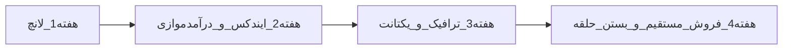

# اکشن‌پلن ۳۰روزه — مظنه آنلاین

سند تیک‌زدنی برای صاحب کسب‌وکار. هر `[ ]` یک کار قابل انجام است.
علامت 👤 یعنی فقط با دسترسی صاحب کسب‌وکار (SSH، پنل آروان، GSC، شبکه‌های تبلیغاتی).

**هدف درآمد ماه:** فعال‌سازی مسیر تبلیغات (یکتانت → مدیااد → فروش مستقیم) با افیلیت موازی.

**قانون ماه:** فیچر محصولی جدید شروع نشود مگر باگ اعتماد/داده لانچ را بشکند.

---

## ۰. فرض‌ها و North Star

### فرض‌ها

- محصول فنی v1 در ریپو تقریباً آماده است (جدول قیمت مؤثر، صفحات پلتفرم/دارایی، بلاگ، اسلات تبلیغ، `/go/`، SEO پایه).
- گلوگاه: لانچ عملیاتی + ترافیک + فروش تبلیغ — نه ساخت از صفر.
- AdSense ممکن نیست. مسیر تبلیغ: **یکتانت** اول، **مدیااد** پشتیبان، **فروش مستقیم به سکوها** هدف اصلی بلندمدت.
- افیلیت تکنوگلد/اکوگلد (۳۰٪ از کارمزد) از هفته ۱–۲ موازی زنده می‌شود.
- امروز همهٔ `referral_url`ها در `collector/src/mazane_collector/platforms.py` برابر `None`اند؛ `/go/<slug>` فعلاً به `website_url` می‌رود.

### چهار خروجی اجباری روز ۳۰

1. `mazane.online` پایدار پشت آروان — معیارهای پذیرش [ops/RUNBOOK.md](../../ops/RUNBOOK.md)
2. Search Console تأیید + sitemap دیده شده + حداقل ۵ پست داده‌محور
3. `referral_url` واقعی برای حداقل تکنوگلد و اکوگلد روی `/go/`
4. جایگاه تبلیغ با یکتانت زنده، **یا** حداقل یک گفتگوی فروش مستقیم با مدیاکیت شروع شده

### معیارهای کمّی روز ۳۰

| شاخص | هدف |
|---|---|
| Uptime / CDN | پادل‌یار قطع نشود؛ origin-down → پاسخ ۲۰۰ کهنه از لبه |
| URL ایندکس‌شده | ≥ ۲۰ (خانه + پلتفرم‌ها + بلاگ) |
| کلیک ارگانیک | سیگنال >0 پایدار در ۷ روز آخر |
| کلیک `/go/` | ردیابی فعال (هدف عددی سخت نه) |
| درآمد تبلیغ | ثبت‌نام ناشر + حداقل یک جایگاه پر (شبکه یا مستقیم) |



---

## هفته ۱ (روز ۱–۷): لانچ بدون فیچر جدید

تمرکز ۱۰۰٪ روی زنده شدن پایدار.

### روز ۱ — پیش‌نیاز استقرار 👤

- [ ] خواندن کامل [ops/RUNBOOK.md](../../ops/RUNBOOK.md) و آماده‌سازی جلسهٔ نظارت‌شده
- [ ] تصمیم رجیستری ایمیج: GHCR **یا** `docker save` دستی (جدول ۱.۲ رانبوک)
- [ ] اگر GHCR: از سرور `curl -sI https://ghcr.io/v2/` و نتیجه را یادداشت کن
- [ ] تأیید `output: "standalone"` در `web/next.config.ts` (پیش‌نیاز Dockerfile.web)
- [ ] کپی `.env.example` → `.env` روی محیط امن؛ مقادیر را پر کن (بدون کامیت)
- [ ] لیست رمزها/توکن‌های لازم: Postgres، Redis، `REVALIDATE` بلاگ، کلیدهای خارجی

### روز ۲ — ساخت ایمیج و استقرار 👤

- [ ] ساخت ایمیج‌ها بیرون از سرور (`linux/amd64`) طبق رانبوک
- [ ] انتقال/pull ایمیج روی `37.32.27.201`
- [ ] افزودن بلوک سایت از `ops/caddy-snippet.Caddyfile` به Caddy پادل‌یار
- [ ] `docker compose -f compose.prod.yml up -d` (یا معادل رانبوک)
- [ ] تأیید سلامت پادل‌یار **قبل و بعد** از تغییر (قانون طلایی رانبوک)

### روز ۳ — آروان + پذیرش لانچ 👤

- [ ] تنظیم CDN آروان روی `mazane.online`
- [ ] معیار ۱ رانبوک: صفحهٔ زنده از پشت آروان + پادل‌یار سالم
- [ ] معیار ۲: تست origin-down → لبه ۲۰۰ کهنه (پیش‌شرط سخت لانچ)
- [ ] معیار ۳: پایش بیرونی + لاگ Googlebot با `ops/verify-googlebot.py`
- [ ] تیک زدن بخش ۰ رانبوک وقتی هر سه معیار سبز شد

### روز ۴ — کد معرف افیلیت 👤

فایل: `collector/src/mazane_collector/platforms.py`

- [ ] ثبت‌نام/ورود پنل معرف **تکنوگلد** → ساخت لینک با `referralCode`
- [ ] ثبت‌نام/ورود پنل معرف **اکوگلد** → ساخت لینک کامل
- [ ] پر کردن `referral_url` برای `technogold` و `ecogold` (نه حدس؛ فقط لینک واقعی پنل)
- [ ] در صورت موجود بودن کد: میلی (`referralCode`) و طلاسی (`r`) هم پر شوند
- [ ] دیپلوی مجدد collector/web پس از تغییر
- [ ] smoke: `/go/technogold` و `/go/ecogold` به لینک معرف بروند نه فقط دامنهٔ خام
- [ ] 👤 ایمیل/درخواست افیلیو برای دیجی‌کالا (اگر هنوز باز است)

الگوی مستند (فقط پارامتر؛ کد را خودت از پنل بگذار):

| سکو | الگو |
|---|---|
| تکنوگلد | `https://app.technogold.gold/?referralCode=YOUR_CODE` |
| میلی | `https://milli.gold/app/sign-up?referralCode=YOUR_CODE` |
| طلاسی | `https://talasea.ir/onboarding/?r=YOUR_CODE` |

### روز ۵ — پنج پست لانچ داده‌محور

طبق معماری بند ۱۳: **۱۰۰٪ داده‌محور** — نه آموزش عمومی طلا.

پیشنهاد موضوع (اعداد را از دادهٔ زندهٔ همان روز بگیر، از مدل ننویس):

1. [ ] مقایسهٔ هزینهٔ رفت‌وبرگشت بین سکوهای دارای کارمزد معلوم
2. [ ] اختلاف ریالی خرید ۱۰۰ میلیون تومان: ارزان‌ترین vs گران‌ترین مؤثر
3. [ ] حدنصاب سفارش و اثرش روی خریدار خرد
4. [ ] وضعیت باز/بسته بودن خرید-فروش (نمونه‌های واقعی همان هفته)
5. [ ] تمایز دفتر سفارش داریک vs OTC — چرا در جدول جدا برچسب می‌خورد

چک تولید محتوا:

- [ ] اعداد فقط از slot/دادهٔ collector پر شوند (خط لولهٔ `mazane-generate` / دروازهٔ اعتبارسنجی)
- [ ] انتشار ۵ پست روی `/blog`
- [ ] smoke: خانه، یک پلتفرم، یک دارایی، فهرست بلاگ، یک پست

### روز ۶ — اعتماد حقوقی و smoke نهایی

- [ ] بازبینی نوار ماده ۵ و صفحات موجود (`/mazane-chist`، `/darbare-pishnahad`)
- [ ] اگر صفحهٔ «قوانین / سلب مسئولیت» نداریم: پیش‌نویس سه ستون TGJU را بنویس و منتشر کن — (۱) معامله نمی‌کنیم (۲) منبع = خود سکوها با timestamp (۳) سلب مسئولیت عدم انطباق
- [ ] هیچ «نرخ مظنه» یا قیمت خودساخته در UI/بلاگ نباشد
- [ ] اسلات‌های تبلیغ با «پیشنهاد سردبیر» پر و از نظر بصری متمایزند
- [ ] لینک‌های درآمدزا `rel="sponsored nofollow noopener"` دارند

### روز ۷ — جمع‌بندی هفته ۱

- [ ] چک‌لیست پذیرش رانبوک کامل تیک خورده
- [ ] سایت از اینترنت موبایل/دسکتاپ باز می‌شود
- [ ] پادل‌یار سالم است
- [ ] ۵ پست زنده‌اند
- [ ] `/go/technogold` و `/go/ecogold` با کد واقعی کار می‌کنند
- [ ] یادداشت یک‌صفحه‌ای: چه چیزی شکست، چه چیزی فردا هفته ۲ را مسدود می‌کند

**Done هفته ۱:** سایت از بیرون باز است، پادل‌یار سالم است، checklist لانچ تیک خورده.

---

## هفته ۲ (روز ۸–۱۴): ایندکس + درآمد موازی

### روز ۸ — Google Search Console 👤

- [ ] ساخت/ورود property برای `https://mazane.online`
- [ ] تأیید مالکیت (DNS TXT یا روش در دسترس)
- [ ] ارسال sitemap: `https://mazane.online/sitemap.xml`
- [ ] درخواست ایندکس برای `/` و ۲–۳ صفحهٔ پلتفرم پرترافیک‌شونده
- [ ] یادداشت نتیجهٔ تست دسترسی (معماری بند ۱۳.۱۴)

### روز ۹ — ممیزی SEO فنی

- [ ] `https://mazane.online/robots.txt` — خط Sitemap و Disallowهای درست (`/go/` نباید ایندکس شود)
- [ ] `sitemap.xml` شامل خانه، پلتفرم‌های listed، دارایی‌های واجد شرط، بلاگ
- [ ] View-source خانه: جدول قیمت مؤثر در HTML اولیه باشد (نه فقط بعد از JS)
- [ ] JSON-LD صفحات کلیدی بدون خطای واضح
- [ ] یک پاس کیفیت صفحهٔ پلتفرم نمونه: H1، کارمزدها، تاریخ به‌روزرسانی، CTA از `/go/` با `rel=sponsored`

### روز ۱۰ — اندازه‌گیری

- [ ] انتخاب ابزار آنالیتیکس قابل‌دسترس در ایران (سرویس ایرانی یا شمارندهٔ خودمیزبان)
- [ ] رویداد/هدف: بازدید خانه، کلیک CTA پلتفرم، hit روی `/go/*`
- [ ] جدا کردن بازدید جایگاه تبلیغ (top/bottom) اگر ابزار اجازه می‌دهد
- [ ] داشبورد حداقلی هفتگی: sessions، top pages، `/go` clicks

### روز ۱۱ — یکتانت 👤

- [ ] ثبت‌نام ناشر در [yektanet.com/publishers](https://www.yektanet.com/publishers/)
- [ ] ارسال سایت برای بررسی (ممکن است چند روز طول بکشد — همین هفته شروع شود)
- [ ] آماده‌سازی توضیح سایت: مقایسهٔ قیمت مؤثر طلای آب‌شدهٔ آنلاین؛ مخاطب در قصد خرید
- [ ] اگر فرم ترافیک/نمونه می‌خواهد: اسکرین جدول + لینک `/darbare-pishnahad`

### روز ۱۲ — مدیاکیت خام (نسخهٔ ۰٫۱)

فایل آماده: [media-kit.md](./media-kit.md) — اعداد و تماس را پر کن:

- [ ] توضیح یک‌خطی محصول
- [ ] فهرست جایگاه‌ها (بالای جدول / پایین جدول) + اندازهٔ تقریبی
- [ ] تفکیک «پیشنهاد سردبیر» (فروشی نیست) vs «تبلیغ»
- [ ] اعداد فعلی بازدید (حتی اگر نزدیک صفر — صادق باش)
- [ ] مخاطب و تمایز vs زرایران (پوشش بیشتر پلتفرم، وضعیت باز/بسته، برچسب دفتر سفارش)

### روز ۱۳ — محتوا و اعتماد YMYL

- [ ] انتشار صفحه/پست «قیمت مؤثر چگونه حساب می‌شود؟» (فرمول معماری بند ۱ + منبع کارمزد)
- [ ] ۰ تا ۳ پست اضافه **فقط** اگر دادهٔ تازهٔ قابل اتکا داری
- [ ] سری زمانی را عمداً نگه دار برای هفته ۴+
- [ ] بازبینی نهایی لینک‌های `/go/` در جدول و صفحات پلتفرم

### روز ۱۴ — جمع‌بندی هفته ۲

- [ ] sitemap در GSC دیده می‌شود (یا خطا ثبت و پیگیری شده)
- [ ] افیلیت دو پلتفرم همچنان سالم است
- [ ] درخواست یکتانت ارسال شده (وضعیت: در انتظار / رد / تأیید)
- [ ] مدیاکیت ۰٫۱ آماده است

**Done هفته ۲:** GSC+sitemap، افیلیت زنده، درخواست یکتانت ارسال شده.

---

## هفته ۳ (روز ۱۵–۲۱): ترافیک اولیه + تبلیغ شبکه

### روز ۱۵–۱۶ — موتور توزیع مالک

تقویم حداقلی (هر روز یک پست کوتاه در **یک** کانال اصلی کافی است):

- [ ] کانال/اکانت اصلی را انتخاب کن (تلگرام یا توییتر/ایکس یا لینکدین)
- [ ] قالب پست: اسکرین جدول + **یک عدد اختلاف ریالی** + لینک خانه
- [ ] ۳ پست در این دو روز منتشر کن
- [ ] ذخیرهٔ بهترین عدد هفته برای استفادهٔ مجدد در outreach

### روز ۱۷ — حضور مفید (نه اسپم)

- [ ] ۲–۳ مشارکت مفید در گروه/انجمن طلا یا فروم مالی (جواب واقعی؛ لینک فقط اگر مرتبط است)
- [ ] رصد `zariran.com`: چه پلتفرم‌هایی ندارند که ما داریم → جملهٔ تمایز بازاریابی
- [ ] لیست ۳ جملهٔ کوتاه تمایز برای بایو و مدیاکیت

### روز ۱۸ — outreach رسانهٔ کوچک

- [ ] ۲–۳ پیج/رسانهٔ مالی کوچک برای معرفی متقابل یا رپورتاژ ارزان
- [ ] پیشنهاد: معاوضهٔ محتوا یا نرخ آزمایشی پایین (بودجهٔ سنگین تریبون نه)
- [ ] لاگ تماس در [outreach-log.md](./outreach-log.md)

### روز ۱۹ — فعال‌سازی تبلیغ 👤

**اگر یکتانت تأیید شد:**

- [ ] ساخت جایگاه و دریافت کد/تگ
- [ ] اتصال به اسلات‌های رزروشدهٔ layout (`web/app/ad-slot.tsx` و نقاط فراخوانی در خانه)
- [ ] برچسب واضح «تبلیغ»
- [ ] تأیید: ترتیب جدول از پول تأثیر نمی‌گیرد
- [ ] بلاک دسته: قمار، سیگنال فردایی، محتوای حساس/غیرمرتبط

**اگر تأیید نشد یا در انتظار ماند:**

- [ ] جایگاه‌ها با پیشنهاد سردبیر بمانند
- [ ] ثبت‌نام/پیگیری **مدیااد** به‌عنوان پشتیبان
- [ ] یک پیام پیگیری به پشتیبانی یکتانت با توضیح ترافیک در حال ساخت

### روز ۲۰ — پایداری داده

- [ ] فقط باگ‌های اعتماد: قیمت کهنه، ردیف گمراه‌کنندهٔ fee UNKNOWN، لینک شکستهٔ `/go/`
- [ ] ماشین‌حساب مبلغ کاربر و فیچرهای بزرگ → بعد از روز ۳۰
- [ ] سلامت collector: polling، sanity، نبود میانگین خودساخته به‌عنوان «نرخ مظنه»

### روز ۲۱ — جمع‌بندی هفته ۳

- [ ] حداقل یک کانال توزیع با انتشار هفتگی فعال است
- [ ] مسیر تبلیغ مشخص است: یکتانت زنده / مدیااد / فقط سردبیر+فروش مستقیم
- [ ] اعداد هفته: بازدید، `/go` clicks، وضعیت ناشر

**Done هفته ۳:** کانال توزیع فعال + مسیر تبلیغ روشن.

---

## هفته ۴ (روز ۲۲–۳۰): فروش مستقیم + بستن حلقه

### روز ۲۲ — آماده‌سازی فروش

- [ ] مدیاکیت را به نسخهٔ ۰٫۲ به‌روز کن (اعداد واقعی هفته ۳)
- [ ] نرخ پیشنهادی آزمایشی ماه اول را بنویس (سایت نوپا: بستهٔ ۲–۴ هفته، نرخ پایین یا مدل performance روی کلیک `/go/`)
- [ ] فهرست ۸ مخاطب اولویت‌دار از سکوهای listed (بازاریابی/رشد)

اولویت پیشنهادی outreach: سکوهایی که در جدول‌اند، بودجهٔ رشد دارند، و از مقایسه سود می‌برند (نه فقط برندهای غول بدون پاسخ‌گویی).

### روز ۲۳–۲۶ — ۵ تا ۸ outreach

برای هر مخاطب:

- [ ] پیدا کردن ایمیل/فرم تماس/لینکدین
- [ ] ارسال پیام یک‌خطی (قالب داخل [outreach-log.md](./outreach-log.md))
- [ ] ثبت در لاگ: تاریخ، مخاطب، کانال، پاسخ
- [ ] یک پیگیری بعد از ۳–۴ روز کاری اگر جواب ندادند

هدف هفته: **باز شدن گفتگو**، نه بستن قرارداد بزرگ.

### روز ۲۷ — اعتماد عملیاتی 👤

- [ ] ثبت/پیگیری ساماندهی (اطلاع‌رسانی) با کد ملی اگر هنوز انجام نشده
- [ ] اینماد برای این مدل الزام روز۱ نیست — وقت را اینجا نسوزان مگر تبلیغ‌دهنده صریح بخواهد
- [ ] پشتیبان‌گیری یادداشت دسترسی‌ها و وضعیت سرویس‌ها

### روز ۲۸–۲۹ — اولین پست‌های سری‌زمانی (اختیاری اگر داده کافی است)

- [ ] اگر ~۴ هفته دادهٔ تاریخچه داری: ۱ پست روند اختلاف کارمزد/قیمت مؤثر
- [ ] در غیر این صورت محتوا را نگه دار؛ کیفیت > تقویم اجباری
- [ ] بازبینی thin-affiliation: ارزش‌افزوده هنوز در HTML و روش‌شناسی دیده می‌شود؟

### روز ۳۰ — گزارش پایان ماه و اولویت ماه ۲

- [ ] پر کردن [month-1-report.md](./month-1-report.md)
- [ ] تصمیم ماه ۲ — دقیقاً **یکی** از این سه را به‌عنوان موتور اصلی انتخاب کن:
  1. دو برابر کردن محتوا/سئو
  2. فشار فروش مستقیم جایگاه
  3. بهینه‌سازی پر کردن یکتانت/مدیااد
- [ ] حداکثر ۳ اولویت ماه بعد — بر اساس دادهٔ همین ماه، نه ایدهٔ جدید
- [ ] آرشیو کردن این چک‌لیست با تاریخ و وضعیت تیک‌ها

**Done هفته ۴:** مدیاکیت نهایی، لاگ outreach، تصمیم واضح ماه ۲.

---

## خارج از scope این ۳۰ روز

- اپ موبایل، API عمومی توسعه‌دهنده، ادمین UI کامل
- افزودن انبوه پلتفرم جدید (مگر مسدودکنندهٔ داده)
- خرید انبوه رپورتاژ از تریبون قبل از داشتن ترافیک/DA
- هر تغییری که ترتیب جدول را به‌خاطر پول عوض کند

---

## ریسک‌ها و پاسخ

| ریسک | پاسخ ۳۰روزه |
|---|---|
| ترافیک ≈ ۰ | افیلیت + outreach دستی؛ درآمد شبکه را انتظاری نگیر |
| رد یکتانت | مدیااد یا بستهٔ آزمایشی فروش مستقیم |
| فشار روی سرور مشترک پادل‌یار | دپلوی محافظه‌کار؛ تست stale-200 قبل از اعلام عمومی |
| اتهام thin affiliate / بی‌اعتمادی | قیمت مؤثر در HTML + روش‌شناسی + برچسب تبلیغ + عدم فروش «پیشنهاد سردبیر» |
| فیلترینگ/ریسک حقوقی قیمت | فقط نقل از سکو با timestamp؛ بدون نرخ خودساخته؛ بدون فردایی |

---

## پیوست الف — قالب مدیاکیت یک‌صفحه

```markdown
# مدیاکیت مظنه آنلاین — نسخه X.Y — تاریخ:

## یک خط
مظنه آنلاین قیمت مؤثر خرید/فروش طلای آب‌شده را بین پلتفرم‌های آنلاین ایران مقایسه می‌کند.

## مخاطب
کاربری که قصد خرید یا جابه‌جایی طلای آنلاین دارد و کارمزد برایش مهم است.

## جایگاه‌ها
| جایگاه | محل | اندازه تقریبی | وضعیت |
|---|---|---|---|
| top | بالای جدول مقایسه | ثابت در layout | سردبیر / تبلیغ |
| bottom | پایین جدول | ثابت در layout | سردبیر / تبلیغ |

## قواعد
- «پیشنهاد سردبیر» تحریریه است و فروخته نمی‌شود (معیار: /darbare-pishnahad).
- تبلیغ پولی برچسب «تبلیغ» دارد و ترتیب جدول را عوض نمی‌کند.
- لینک‌ها rel=sponsored.

## اعداد فعلی (صادقانه)
- بازدید ماهانه/هفتگی:
- صفحات ایندکس‌شده:
- پوشش پلتفرم: N سکو در جدول عمومی

## تمایز
پوشش وسیع‌تر از رقیب مستقیم، وضعیت باز/بستهٔ معامله، برچسب دفتر سفارش، قیمت مؤثر نه فقط قیمت اسمی.

## تماس
نام / ایمیل / تلگرام:
```

---

## پیوست ب — قالب outreach و لاگ

### پیام کوتاه (ایمیل/دایرکت)

```
موضوع: جایگاه آزمایشی در جدول مقایسه قیمت مؤثر طلا — مظنه آنلاین

سلام،
مظنه آنلاین قیمت مؤثر (با احتساب کارمزد) پلتفرم‌های طلای آنلاین را مقایسه می‌کند.
برای [نام سکو] یک بستهٔ آزمایشی ۲–۴ هفته روی جایگاه ثابت بالای جدول پیشنهاد می‌کنیم —
جدا از «پیشنهاد سردبیر» که فروشی نیست.
مدیاکیت یک‌صفحه و گزارش کلیک هفتگی ضمیمه/آماده است.
اگر مسئولش شما نیستید ممنون می‌شوم ارجاع بدهید.
```

### لاگ outreach

| # | تاریخ | سکو/رسانه | کانال | وضعیت | پیگیری | نتیجه |
|---|---|---|---|---|---|---|
| 1 | | | | ارسال شد | | |
| 2 | | | | | | |
| 3 | | | | | | |
| 4 | | | | | | |
| 5 | | | | | | |
| 6 | | | | | | |
| 7 | | | | | | |
| 8 | | | | | | |

---

## پیوست ج — گزارش پایان ماه (روز ۳۰)

```markdown
# گزارش ماه ۱ — مظنه آنلاین
بازه: از ____ تا ____

## لانچ و پایداری
- معیارهای RUNBOOK: کامل / ناقص (توضیح)
- حادثهٔ قطعی پادل‌یار یا مظنه:

## ایندکس و سئو
- URL ایندکس‌شده:
- Top queries (اگر آمده):
- کلیک/نمایش ارگانیک ۷ روز آخر:

## درآمد
- وضعیت یکتانت:
- وضعیت مدیااد:
- کلیک /go/ کل ماه:
- درآمد افیلیت ثبت‌شده (اگر پنل دارد):
- گفتگوهای فروش مستقیم باز:

## توزیع
- کانال اصلی و تعداد پست:
- بهترین پست از نظر کلیک:

## تصمیم ماه ۲
موتور اصلی: محتوا/سئو | فروش مستقیم | بهینه‌سازی شبکه
سه اولویت:
1.
2.
3.
```

---

## ارجاع سریع فایل‌ها

| موضوع | مسیر |
|---|---|
| همین اکشن‌پلن | [30-day-action-plan.md](./30-day-action-plan.md) |
| مدیاکیت | [media-kit.md](./media-kit.md) |
| لاگ outreach | [outreach-log.md](./outreach-log.md) |
| گزارش ماه ۱ | [month-1-report.md](./month-1-report.md) |
| رانبوک لانچ | [ops/RUNBOOK.md](../../ops/RUNBOOK.md) |
| معماری و تصمیم‌ها | [docs/design/01-architecture.md](../design/01-architecture.md) |
| SEO | [docs/research/02-seo-and-indexing.md](../research/02-seo-and-indexing.md) |
| حقوقی و تبلیغات | [docs/research/03-legal-monetization-infrastructure.md](../research/03-legal-monetization-infrastructure.md) |
| رجیستری سکو / referral | [collector/src/mazane_collector/platforms.py](../../collector/src/mazane_collector/platforms.py) |
| اسلات تبلیغ | `web/app/ad-slot.tsx` |
| معیار سردبیر | `/darbare-pishnahad` |
